# Lab 1 – Identidade e Onboarding/Integração

## Visão geral

Neste primeiro laboratório, veremos o que é necessário para fazer com que novos tenants sejam integrados em um sistema SaaS. A integração é um dos aspectos mais básicos de SaaS. Ela cria a forma de como os tenants e usuários serão representados em nosso sistema, determinando como os tenants serão identificados e transmitidos à medida que fluem por todas as partes da arquitetura SaaS.

Uma parte importante desse processo é apresentar a noção de uma **Identidade SaaS**. Em muitos sistemas, a identidade do usuário será representada em um provedor de identidade completamente separado de seu relacionamento com um tenant. Um tenant é então resolvido de alguma forma como uma etapa separada. Isso adiciona sobrecarga e complexidade. Em vez disso, neste laboratório, você verá como fazer uma relação mais próxima entre usuários e tenant e criar uma **identidade SaaS** que podemos então encaminhar pelos vários serviços de nosso sistema. Isso simplifica a implementação de serviços que precisam de acesso ao contexto de tenant pois não precisam resolver em uma etapa separada.

Veremos primeiro como os usuários são representados em um provedor de identidade. Mais especificamente, veremos como o **Amazon Cognito** pode ser configurado para suportar os fluxos de autenticação e integração de nossa solução SaaS. Também usaremos essa oportunidade para configurar atributos de usuário que nos permitem criar uma conexão entre usuários e tenant. Isso permitirá que o processo de autenticação do Cognito retorne tokens de autenticação que incluem contexto de tenant.

Depois de configurar os usuários, voltaremos nossa atenção para como os tenants são representados em nossa arquitetura. Os tenants têm seu próprio perfil e dados configurados separadamente dos usuários associados a esse tenant. Apresentaremos um microsserviço que possui a criação e o gerenciamento desses atributos de tenant (níveis, status, políticas, etc.).

Com o gerenciamento de usuários e tenants implementado, voltaremos nossa atenção para a aplicação web do usuário final que atua como front-end para o sistema de integração.

Depois de criar um novo tenant e um usuário com baixo privilégio neste tenant usando a aplicação web, veremos como o sistema de orquestração de autenticação e registro usa o recurso de custom claims do padrão OpenID Connect para intermediar nossa identidade SaaS por meio de tokens de segurança nos cabeçalhos HTTP.

Ao final do Laboratório 1, todos os elementos estarão prontos para integrar e autenticar os tenants e seus usuários. O diagrama abaixo destaca os principais elementos necessários para dar suporte a essa experiência.

<p align="center">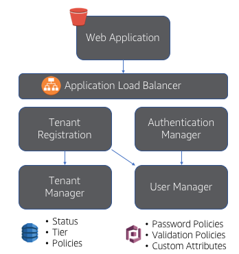</p>

No topo do diagrama está a aplicação web **Web Application** que fornece a interface para nossos fluxos de integração e autenticação. Ela se conecta aos microsserviços por meio de um gateway de API. Abaixo do Amazon API Gateway estão os vários microsserviços necessários para dar suporte a esses fluxos de integração. O **Tenant Registration** é o orquestrador do processo de integração, invocando o **User Manager** para criar usuários no Amazon Cognito e o **Tenant Manager** para criar os tenants. O **Authentication** autentica usuários por meio do serviço **User Manager**.

### O que você estará construindo
Conforme você avança no Laboratório 1, você criará, configurará e implantará os elementos descritos acima. A seguir está uma análise das etapas que você executará para obter experiência de integração e autenticação SaaS:
* Criar o pool de usuários - neste cenário usaremos os pools de usuários do Cognito para gerenciar e lidar com a identidade do usuário. Nesta parte do laboratório, vamos guiá-lo pelas etapas de configuração do Amazon Cognito.
* Criar e gerenciar usuários - a seguir, examinaremos o microsserviço **User Manager** afim de observar como ele fornece uma API de abstração. Vamos testar o microsserviço manualmente, usando a linha de comando.

* Criar e gerenciar tenants - na parte 3, examinaremos os recursos do microsserviço **Tenant Manager** afim de observar como ele mantém os dados de nível do tenant separados dos usuários. Vamos testar o microsserviço manualmente, usando a linha de comando.

* Integração orquestrada - Por fim, utilizando a interface web integraremos um novo tenant e seu primeiro usuário administrador. Isso reúne todas as peças e mostra como o Cognito gerencia o trabalho pesado do fluxo de autenticação. Adicionaremos um usuário não administrador ao mesmo tenant e veremos como a autorização complementa a autenticação para restringir o acesso a determinados recursos. Concluiremos examinando a tecnologia JWT usada nos tokens de segurança.

## Parte 1 - Criar o pool de usuários
Nosso objetivo para a parte 1 é que você configure todos os elementos do Amazon Cognito manualmente para que você entenda todas as partes que serão usadas pela solução completa para integrar, gerenciar e autenticar usuários. Também apresentaremos a capacidade de associar usuários a tenants, o que nos permite criar uma **Identidade SaaS**.

Neste workshop, estaremos associando cada tenant a um pool de usuários Cognito separado. A solução final cria esses pools Cognito durante a integração. Cada pool é configurado da mesma maneira para aplicar as configurações de integração e identidade de nossos tenants.

**Etapa 1** - Navegue até o serviço Amazon Cognito no AWS Console e selecione **Manage User Pools**.

<p align="center">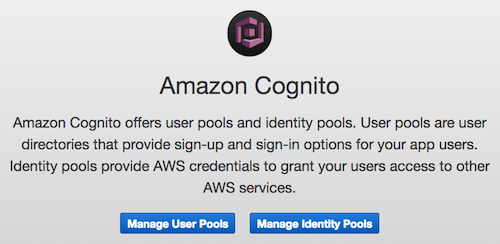</p>

**Etapa 2** - Selecione **Create A User Pool** no canto superior direito do console Cognito.

<p align="center">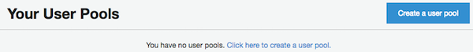</p>

**Etapa 3** - Você verá uma experiência de criação de pool de usuários (mostrada abaixo) que é usada para configurar todos os elementos de sua identidade e experiência de integração. O primeiro passo neste processo é dar um nome ao seu pool. Escolha o nome que desejar (por exemplo, **SaaS Bootcamp Users**).

<p align="center">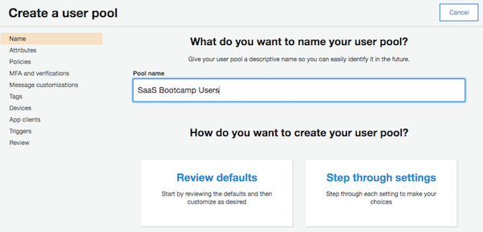</p>

**Etapa 4** - Selecione **Step through settings** para configurar o pool para oferecer suporte à experiência de integração que desejamos que nossos usuários de SaaS tenham.

A primeira etapa nos permite configurar os atributos do pool. Vamos começar examinando as políticas de login. A tela abaixo representa as opções que você terá.

<p align="center">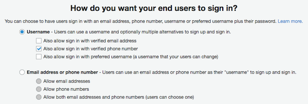</p>

Estamos especificando quais opções um usuário pode ter para seu identificador exclusivo (seu e-mail nesta circunstância). Para nossa solução, vamos marcar a opção **Also allow sign in with a verified phone number**.

**Etapa 5** - Agora passamos para a parte dos atributos padrão da configuração do pool de usuários. É apresentado a você uma coleção de atributos padronizados que são gerenciados pelo Cognito. Selecione os atributos **e-mail**, **family name**, **given name**, **phone number** e **preferred username**.

<p align="center">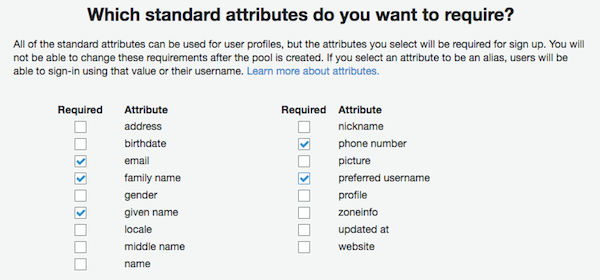</p>

**Etapa 6** - Agora vamos configurar mais detalhes de SaaS nos atributos personalizados de nosso pool de usuários. É aqui que apresentamos os atributos que conectam usuários a tenants. Ao provisionar tenants, manteremos esses atributos adicionais como parte do perfil de cada usuário. Esses mesmos dados também serão incorporados aos tokens que são retornados pelo processo de autenticação.

Role a página para baixo e clique em **Add custom attribute** na seção "Do you want to add custom attributes?"

<p align="center"></p>

Adicione os seguintes atributos de tenant, clicando em **Add another attribute** para cada novo atributo a ser adicionado:
* **tenant_id** (string, default max length, _**not**_ mutable)
* **tier** (string, default max length, mutable)
* **company_name** (string, default max length, mutable)
* **role** (string, default max length, mutable)
* **account_name** (string, default max length, mutable)

Os atributos são case-sensitive. Sua tela deve ficar da seguinte forma:

<p align="center">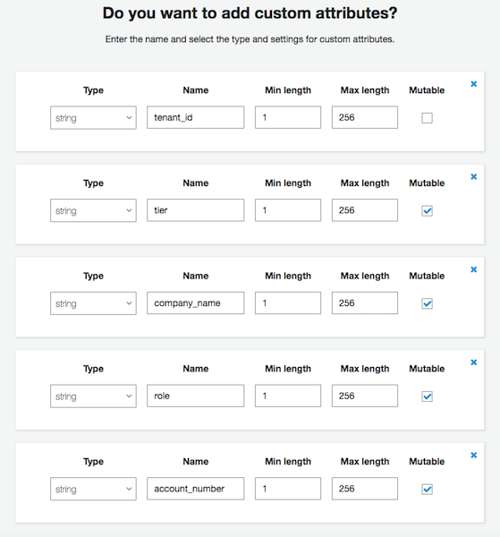</p>

**Etapa 7** - Depois de configurar os atributos personalizados, clique no botão ** Next step** na parte inferior da tela. Isso nos leva à página de políticas.

Aqui podemos configurar a senha e as políticas de administração. Essas políticas (e outras configuradas com pools de usuários) nos permitem variar a abordagem de cada tenant. Você poderia, por exemplo, trazer à tona essas opções na experiência de administração de tenant de sua solução SaaS, permitindo que tenants individuais configurem suas próprias políticas.

<p align="center">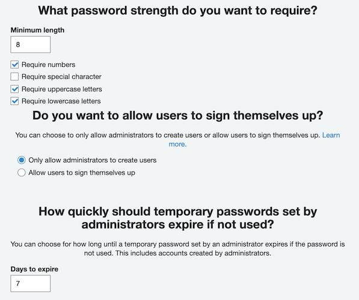</p>

Para nossa solução, substituiremos algumas das opções padrão.

Primeiro, vamos desativar a opção **Require special character** para nossas políticas de senha. Além disso, selecione a opção **Only allow administrators to create users** para limitar quem pode criar novos usuários no sistema.

Depois de concluir esta seção, clique no botão **Next step** na parte inferior da página.

**Etapa 8** - Estamos agora na seção MFA e verificações. Para alguns provedores de SaaS, ou mesmo tenants individuais, pode ser valioso habilitar o MFA. Para esta solução, no entanto **vamos deixá-lo desabilitado**. Não mude nada nesta tela.

Esta página nos dá a opção de configurar como as verificações serão entregues. Para este laboratório **vamos deixar as configurações padrão **.

Se você optar por habilitar a verificação do número de telefone ou MFA, o Cognito precisaria de uma função IAM para permissões para enviar uma mensagem SMS para o usuário via Amazon SNS. **Para este laboratório, basta clicar no botão "Next step"**.

**Etapa 9** - A quarta etapa do assistente é a página **Personalizações de mensagens**. Como parte de nosso processo de integração, enviaremos e-mails aos usuários para verificar sua identidade. Também podemos confiar no Cognito para essa funcionalidade. Essa tela nos permite configurar como esse processo de verificação funcionará. _Para este bootcamp, usaremos as configurações de mensagem de verificação padrão_.

Role a página para baixo até a seção “**Do you want to customize your user invitation messages?**”. Personalize o e-mail de convite que será enviado pela Cognito à medida que cada novo tenant se inscrever da seguinte forma:

Altere o assunto de "Your temporary password" para "**Novo tenant do workshop de SaaS**" e o texto **Email message* para:

```html
 <br><br>
Bem-vindo ao workshop de SaaS na AWS. <br><br>
Username: {username} <br><br>
Password: {####}.
```

<p align="center">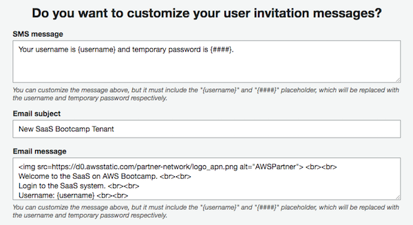</p>

O Cognito também tem a capacidade de customizar alguns dos cabeçalhos de e-mail para seus e-mails de verificação e convite. Vamos deixar essas configurações padrão para este workshop. Clique no botão **Next step**.

**Etapa 10 * - Para este workshop, _pularemos_ as seções **Tags** e **Devices**. Basta clicar no botão **Next step** _ **duas vezes * _ para avançar para a tela de **App clients**.

**Etapa 11** - Agora que criamos os fundamentos de nosso pool de usuários, precisamos criar um App client para esse pool. Este cliente é uma peça fundamental do Cognito. Ele fornece o contexto pelo qual podemos acessar os fluxos _unauthenticated_ que são necessários para se registrar e entrar no sistema. Você pode imaginar como isso é fundamental para nossa experiência de integração. Selecione o link **Add an app client** na tela a seguir:

<p align="center">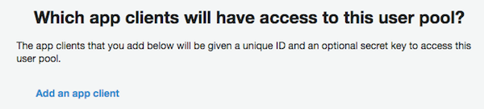</p>

**Etapa 12** - Agora podemos configurar o novo aplicativo cliente. Digite um nome para o seu cliente (por exemplo, **SaaS App Client**) e desmarque as três caixas **Generate client secret**, **Enable lambda trigger based custom authentication (ALLOW_CUSTOM_AUTH)** e **Enable SRP (secure remote password) protocol based authentication (ALLOW_USER_SRP_AUTH)**.

A opção de segredo do cliente nesta tela se refere a um segredo do cliente OAuth 2.0. Isso não é usado para aplicativos "públicos" (web ou móveis) em que um usuário digitará suas credenciais.

Depois de fazer essas alterações, selecione o botão **Create app client** e, em seguida, o botão **Next step** para continuar o assistente.

<p align="center">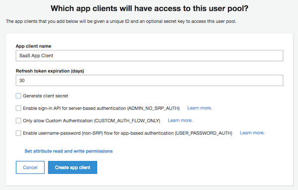</p>

**Etapa 13** - Para este bootcamp, _pularemos_ a seção **Triggers**. Role até a parte inferior da tela e clique no botão **Next step** para avançar para a tela de revisão final e clique em **Create pool**.

**Etapa 14** - Antes de prosseguir, queremos registrar a id que foi gerada para este pool de usuários e a id do cliente do aplicativo. Copie e cole o valor **Pool Id** da tela **General Settings** em um arquivo temporário ou abra a próxima etapa em uma janela ou guia separada do navegador da web. Além disso, selecione a guia **App clients** na lista à esquerda e salve seu **App client id**. Usaremos esses dois valores em uma etapa subsequente.

<p align="center">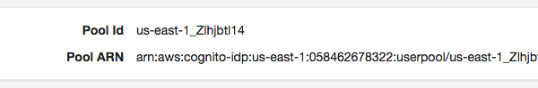</p>

<p align="center">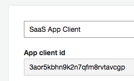</p>

**Etapa 15** - A parte do pool de usuários está concluída. Antes de podermos usar esse pool de usuários, precisaremos conectá-lo a um **Identity Pool**. Os Cognito Identity Pools fornecem o mecanismo para trocar um token autenticado do User Pool por um conjunto de chaves de acesso da AWS que controlam o acesso aos recursos da AWS, como buckets S3 ou tabelas DynamoDB.

Para configurar seu pool de identidade, navegue de volta à página principal do Cognito selecionando o ícone AWS no canto superior esquerdo e, em seguida, selecionando Cognito novamente na lista de serviços. Selecione o botão **Manage Identity Pools**.

<p align="center"></p>

**Etapa 16** - O assistente deve ser iniciado para que você crie um novo pool de identidade porque você não tem nenhum pool existente para listar. Digite o nome do seu novo pool de identidade (por exemplo, **SaaS Identity Pool**).

<p align="center">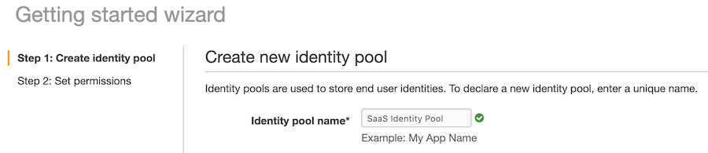</p>

**Etapa 17** - Expanda a seção **Authentication Providers** na parte inferior da tela clicando no triângulo. Aqui é onde criaremos a conexão entre nosso pool de usuários e o pool de identidade. Você verá uma coleção de guias aqui que representam os vários provedores de identidade que o Cognito suporta. Usaremos a primeira guia, **Cognito**. Você verá opções aqui para inserir o User Pool ID, bem como o App client id que foram capturadas acima. Se você não os copiou antes, você pode acessá-los a partir dos atributos do pool de usuários que você criou acima.

<p align="center">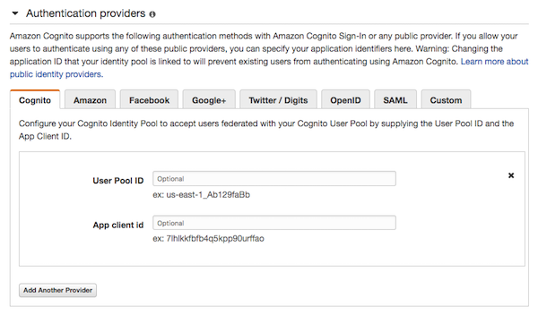</p>


**Etapa 18** - Selecione o botão **Create Pool** no canto inferior direito da página.

**Etapa 19** - Finalmente, selecione o botão **Allow** na próxima página para permitir que seu novo pool de identidade acesse os recursos da AWS. Isso completará o processo de criação.

**Recapitulando**: Até agora, você tem todas as peças móveis instaladas para que seu sistema SaaS gerencie usuários e associe esses usuários a tenants. Também configuramos as políticas que controlarão como o sistema valida os usuários durante a integração. Isso inclui a definição de políticas de senha e nome de usuário. A última seção configurou um pool de identidade para permitir o acesso autenticado aos recursos da AWS.

## Parte 2 - Gerenciando Usuários

Embora tenhamos configurado a infraestrutura AWS para suportar o gerenciamento de nossas identidades de usuário com o Cognito, ainda precisamos de algum mecanismo que permita que nosso aplicativo acesse e configure esses elementos em tempo de execução. Para chegar lá, precisamos apresentar um microsserviço que ficará na frente das APIs do Cognito. Isso encapsula nossos recursos de gerenciamento de usuário e simplifica a experiência do desenvolvedor, ocultando os detalhes da API Cognito.

Instead of building this microservice from scratch, we're going to simply review the sample code deployed as a Docker container image to **Amazon Elastic Container Service** (ECS).

**Etapa 1** - Vamos abrir o código e dar uma olhada. Para simplificar essa experiência e garantir que todos tenham as ferramentas de linha de comando necessárias para acompanhar, provisionamos uma IDE (Integrated Development Environment) **AWS Cloud9** para você.

Para começar a usar o Cloud9, escolha-o no AWS Console na categoria **Development Tools**. Uma tela listando seus IDEs disponíveis será exibida. Clique no botão **Open IDE** no**SaaS Bootcamp IDE** para iniciar o Cloud9 em uma nova guia do navegador.

<p align="center">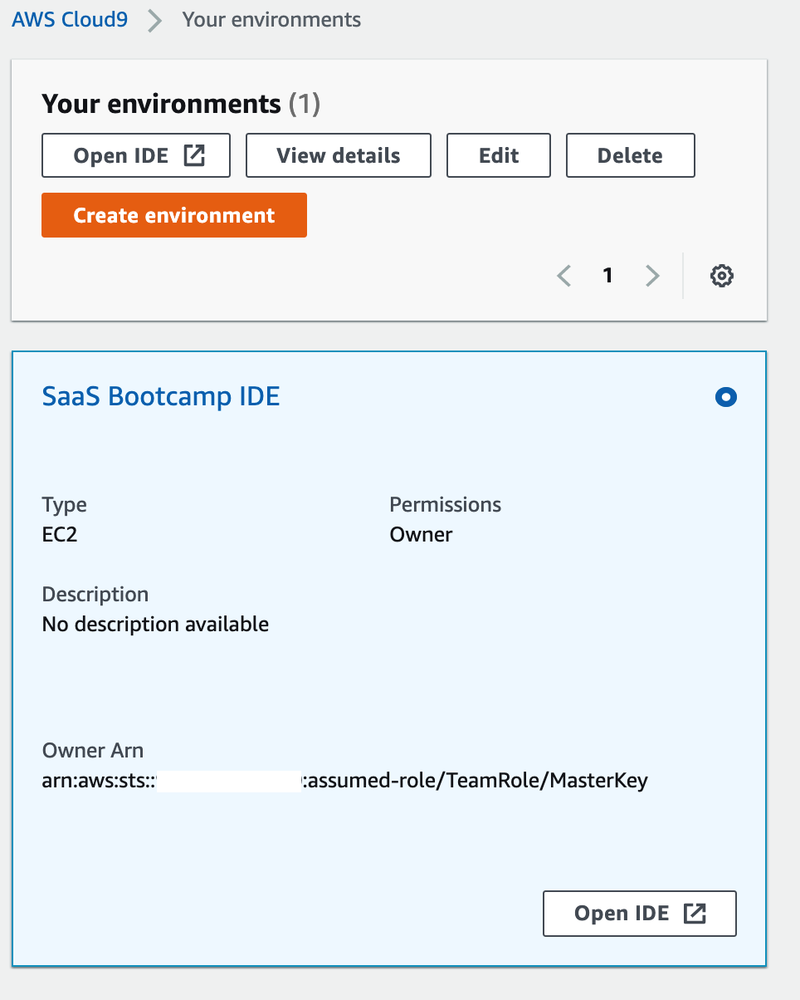</p>

**Etapa 2** - Quando seu IDE Cloud9 foi iniciado, ele clonou automaticamente o repositório GitHub para este workshop e você deve ver uma árvore de pastas no lado esquerdo com a pasta `aws-saas-factory-bootcamp` listada. Expanda esta árvore e navegue até a pasta `source/user-manager`. Clique duas vezes no arquivo **server.js** para abri-lo no painel do editor. Este arquivo é um arquivo **Node.js** que usa a estrutura de aplicativo da web **Express** para implementar uma API REST para gerenciar usuários. Abaixo está uma lista de alguns dos pontos de entrada que podem ser de interesse para este fluxo de integração.

```javascript
app.get('/user/pool/:id', function(req, res) {...});
app.get('/user/:id', function(req, res) {...});
app.get('/users', function(req, res) {...});
app.post('/user/reg', function(req, res) {...});
app.post('/user/create', function(req, res) {...});
app.post('/user', function(req, res) {...});
app.put('/user', function(req, res) {...});
app.delete('/user/:id', function(req, res) {...});
```

Estes representam pontos de entrada HTTP no serviço de gerenciador de usuário e incluem operações CRUD básicas (criar, ler, atualizar, excluir), bem como funcionalidade para suportar o registro e busca de dados do Cognito User Pool para um determinado nome de usuário.

**Etapa 3** - Como o Cognito servirá como o repositório para armazenar nossos usuários, o serviço de gerenciador de usuários deve fazer chamadas para a API do Cognito para persistir novos usuários que são criados no sistema. Para ilustrar isso, vamos dar uma olhada mais de perto em uma versão inicial do método POST no gerenciador de usuários que criará novos usuários no Cognito. Você verá que nosso método `app.post` obtém um objeto de usuário formatado em JSON do corpo da solicitação que é então passado para nosso pool de usuários do Cognito por meio do método `createUser` do SDK do Cognito.

```javascript
app.post('/user/create', function (req, res) {
    var newUser = req.body;
    
    var credentials = {};
    tokenManager.getSystemCredentials(function (systemCredentials) {
        if (systemCredentials) {
            credentials = systemCredentials;
        
            cognitoUsers.createUser(credentials, newUser, function(err, cognitoUsers) {
                if (err) {
                    res.status(400).send('{"Error": "Error creating new user"}');
                } else {
                    res.status(200).send(cognitoUsers);
                }
            });

        } else {
            res.status(400).send('{"Error": "Could not retrieve system credentials"}');
        }
    });
});
```

**Etapa 4** - Agora que temos uma visão mais clara do que está acontecendo nos bastidores, vamos fazer uma chamada para este serviço REST para criar um usuário no **Pool de usuários Cognito** para nosso tenant.

Para conseguir isso, você precisará da URL de chamada do **API Gateway** que está na frente do nosso microsserviço e do **Pool Id** do Cognito que você salvou antes ao configurar o User Pool.

Navegue até o console do **API Gateway** listado sob o título **Networking** no console da AWS. Selecione a API **saas-bootcamp-api**. No menu à esquerda, selecione o link **Stages**. No topo da árvore de estágios implantados, você deve ver um estágio **v1** para a "versão 1". Clique nele e, na área principal da tela, você verá o **Invoke URL** para este estágio do API Gateway implementado. Por exemplo:

<p align="center">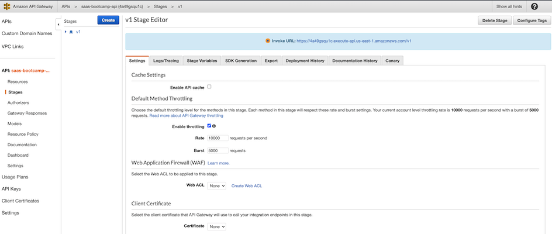</p>

**Etapa 5** - Se você precisar recuperar seu ID do pool de usuários novamente, navegue até o serviço Cognito no console da AWS e selecione o botão **Manage User Pools**. Você verá uma lista de pools de usuários que foram criados em sua conta. Selecione o pool de usuários que você criou anteriormente para exibir informações sobre o pool de usuários.

<p align="center">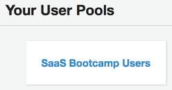</p>

**Etapa 6** - Depois de selecionar o pool, será apresentada uma página de resumo que identifica os atributos do seu pool de usuários. O que você procura é o **Pool Id**, que é mostrado no topo da página (semelhante ao que é mostrado abaixo).

<p align="center">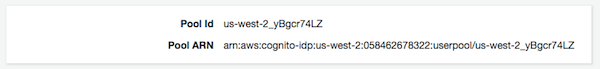</p>

**Etapa 7** - Agora que você tem a id do pool e a URL de chamada, está pronto para chamar o método REST no serviço de gerenciador de usuários para criar um usuário no Cognito. Para chamar nosso ponto de entrada REST, precisaremos invocar o método POST de criação de usuário. Você pode fazer isso por meio de uma variedade de ferramentas (cURL, Postman, etc.). Usaremos a linha de comando do terminal disponível na Cloud9.

A tela de boas-vindas do Cloud9 será aberta como uma guia no painel do editor. _Abaixo_ do painel do editor de código, você deve ver uma série de guias de linha de comando. Você pode usar uma linha de comando existente ou abrir uma nova janela de terminal clicando no botão verde de mais e escolher **New Terminal** ou usar o atalho de teclado `Alt/Opt-T`.

<p align="center">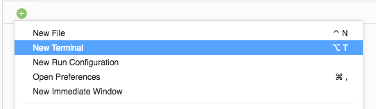</p>

Use a linha de comando do terminal Cloud9 para invocar o comando REST para criar um novo usuário. Copie e cole o seguinte comando (certifique-se de rolar para selecionar o comando inteiro), substituindo **USER-POOL-ID** pelo ID do pool que você capturou nas configurações do Pool de usuários do Cognito e **INVOKE-URL** pela URL que você capturou das configurações do estágio do API Gateway.

```bash
curl -w "\n" --header "Content-Type: application/json" --request POST --data '{"userPoolId": "USER-POOL-ID", "tenant_id": "999", "userName": "test@test.com", "email": "test@test.com", "firstName": "Test", "lastName": "User", "role": "tenantAdmin", "tier": "Advanced"}' INVOKE-URL/user/create
```

Em caso de sucesso, o objeto de usuário recém-criado será retornado no formato JSON.

**Etapa 8** - Agora você pode verificar se seu novo usuário foi criado no pool de usuários do Cognito. Mais uma vez, vamos retornar ao serviço Cognito no console da AWS. Depois de selecionar o serviço, selecione **Manage User Pools** e selecione o pool de usuários criado acima para detalhar esse pool.

Selecione **Users and groups** no menu à esquerda. Ao selecionar esta opção, você verá a lista de usuários em seu pool. Você pode ter que clicar no pequeno ícone de atualização no canto superior direito para ver todos os usuários.

<p align="center">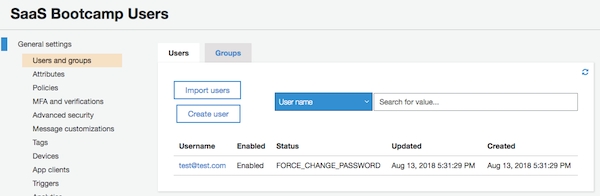</p>

**Etapa 9** - Seu usuário recém-adicionado deve aparecer nesta lista. Selecione o link do nome de usuário para obter informações mais detalhadas sobre o usuário. Você verá informações do usuário com o tenant, o nome e o endereço de e-mail que você forneceu por meio do comando REST.

<p align="center">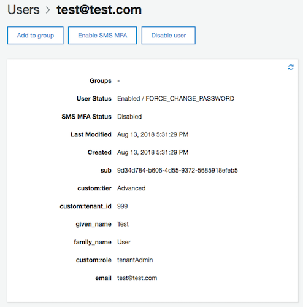</p>

**Recapitulando**: Nesta sessão, apresentamos o AWS Cloud9 IDE para facilitar a visualização do código-fonte de exemplo do workshop e suas ferramentas de linha de comando de terminal Linux integradas. Investigamos como construímos um serviço de gerenciamento de usuários em uma arquitetura de microsserviços para abstrair os detalhes da API Cognito. Você também pode ver como o serviço de gerenciamento de usuários criou novos usuários em seu pool de usuários.

Embora tenhamos nos concentrado aqui em criar o pool de usuários e usuários de forma manual, a versão final desta solução automatizará a criação do pool de usuários para cada tenant durante a integração.

## Parte 3 - Gerenciando Tenants

Neste ponto, temos uma maneira de criar usuários como parte do processo de integração. Também temos uma maneira de associar esses usuários a tenants. O que está faltando é alguma capacidade de armazenar e representar os tenants.

Os tenants devem ser representados e gerenciados separadamente dos usuários. Eles têm políticas, níveis, status e assim por diante - todos os quais devem ser gerenciados por meio de um contrato e serviço separados.

Felizmente, o gerenciamento desse serviço é relativamente simples. Ele simplesmente requer um microsserviço CRUD (criar, ler, atualizar, excluir) que gerenciará os dados armazenados em uma tabela do DynamoDB.

**Etapa 1** - O Tenant Manager também foi implantado em um contêiner ECS Fargate como um microsserviço Node.js. Ele também tem uma API REST e podemos exercitá-la por meio da linha de comando, assim como fizemos com o serviço User Manager.

Envie o seguinte comando para criar um novo tenant. Copie e cole o seguinte comando (certifique-se de rolar para selecionar o comando inteiro), substituindo **INVOKE-URL** pelo URL que você capturou das configurações de estágio do API Gateway.

```bash
curl -w "\n" --header "Content-Type: application/json" --request POST --data '{"tenant_id": "111", "role": "tenantAdmin", "company_name": "Test SaaS Tenant", "tier": "Advanced", "status": "Active"}' INVOKE-URL/tenant
```

**Etapa 2** - Vamos verificar se nosso tenant foi salvo no banco de dados. Navegue até o serviço DynamoDB no console AWS e selecione a opção **Tables** na lista de navegação no canto superior esquerdo da página.

<p align="center"></p>

**Etapa 3** - Localize e selecione o hyperlink da tabela **TenantBootcamp** na lista de tabelas do DynamoDB e selecione a guia **Items** para visualizar os dados na tabela.

<p align="center">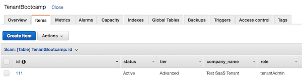</p>

Você deve ver um item na tabela contendo todos os atributos enviados por meio do comando cURL.

**Recapitulando**: o objetivo desta seção era apenas apresentar a você o serviço gerenciador de tenants e a representação separada dos dados de tenants. O **tenant_id** nesta tabela DynamoDB será associado a um ou mais usuários por meio do atributo **tenant_id** que criamos como um atributo personalizado no pool de usuários do Cognito. Ao separar os dados de tenant de nossos atributos de usuário, temos um caminho claro para como os tenants são gerenciados e configurados.

## Parte 4 –  O Onboarding & Aplicação de autenticação 

Todos os microserviços estão implementados e as partes do backend da infraestrutura estão no lugar para suportar o processo de onboarding. Agora iremos nos atentar à aplicação que pode engajar os serviços para os tenants de onboard e autenticação. Não iremos nos aprofundar nos detalhes da aplicação web. É uma aplicação AngularJS relativamente elementar, hospedada no **Amazon S3**.

É importante notar que as regras e mecanismos deste fluxo de trabalho refletem as políticas e configurações escolhidas quando o grupo de usuários é criado no Cognito. Mecanismos de validação e políticas de senha, por exemplo, serão impostos e orquestrados pelo Cognito. 


**Passo 1** – Antes de abrirmos a aplicação web, vamos observar uma amostra do código da interface do usuário que invocará os serviços REST que cobrimos acima. O código que segue foi extraido do controlador `register.js` encontrado em `source/web-client/app/scripts/controllers/register.js`. Quando o formulário de registro é preenchido e o usuário seleciona o botão de **Register**, o sistema chamará o seguinte trecho de código:

```javascript
$scope.formSubmit = function () {
    if (!($scope.tenant.email || $scope.tenant.companyName)) {
        $scope.error = "User name and company name are required. Please enter these values.";
    } else {
        var tenant = {
            tenant_id: '',
            companyName: $scope.tenant.companyName,
            accountName: $scope.tenant.companyName,
            ownerName: $scope.tenant.email,
            tier: $scope.tenant.plan,
            email: $scope.tenant.email,
            userName: $scope.tenant.email,
            firstName: $scope.tenant.firstName,
            lastName: $scope.tenant.lastName
        };

        $http.post(Constants.TENANT_REGISTRATION_URL + '/reg', tenant)
                .then(function (data) {
                    console.log('Registration success');
                    $scope.hideRegistrationForm = true;
                    $scope.showSuccessMessage = true;
                })
                .catch(function (response) {
                    $scope.error = "Unable to create new account";
                    console.log('Registration failed: ', response);
                });
    }
};
```

Perceba que copiamos os conteúdos do formulário HTML e construímos um objeto JSON `tenant` que contém todos os atributos do nosso novo tenant. Então, fazemos a chamada REST que envia os dados deste JSON tenant para o serviço de registro de tenants. O serviço de registro orquestra chamadas para o gerenciador de usuários e o gerenciador de tenants para provisionar todos os elementos da área de cobertura do tenant.

**Passo 2** – Nossa aplicação é considerada estática porque utiliza JavaScript para modificar visualizações de HTML diretamente no navegador sem precisar recarregar toda URL do servidor. **Amazon S3** prove hospedagem _serverless_ de sites estáticos. Para minimizar o atraso geográfico no carregamento do seu website e para descarregar a criptografia HTTPS, nós colocamos uma distribuição do Amazon CloudFront na frente do bucket S3 que está hospedando nosso website. Nós precisamos capturar a URL da nossa aplicação do CloudFront.  

Navegue para o serviço **CloudFront** sob a categoria **Networking & Content Delivery** no console AWS. Uma distribuição foi criada para nossa aplicação web. Copie a URL e abra em uma nova janela ou aba do navegador.

**Passo 3** – A página de destino do aplicativo solicitará que você faça login. Esta página é para tenants já registrados. Você não possui tenants ainda, então, você precisará selecionar o botão **Register** (ao lado direito do botão **Login**). Ao selecionar este botão você será direcionado a um formulário onde poderá registrar seu novo tenant.

<p align="center">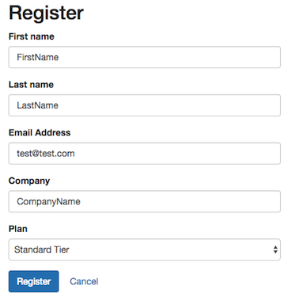</p>

Insira os dados para seu novo tenant e seu usuário administrador inicial. O valor chave aqui é seu endereço de e-mail. _Você deve inserir um endereço de email onde possa acessar as mensagens_ que será utilizado para completar este processo de registro. Os valores restantes podem ser da sua escolha. Este será o primeiro tenant no seu sistema e criaremos outro no próximo lab. 

O valor “Plan” é incluído simplesmente para transmitir que é durante o onboarding onde você capturaria os diferentes níveis de sua oferta de produto.

Uma vez que o formulário esteja completado, selecione o botão **Register** e depois de um segundo ou dois você será apresentado a uma mensagem indicando que você se registrou e deverá estar recebendo um email para validar sua identidade.

**Passo 4** – Agora cheque seu email para validação da mensagem que foi enviada pelo Cognito. Você deverá encontrr uma mensagem na sua caixa de entrada que inclui seu nome de usuário (seu endereço de email) juntamente com uma senha temporária (gerada pelo Cognito). A mensagem será similar à seguinte: 

<p align="center"></p>

**Passo 5** – Agora podemos fazer login na aplicação usando essas credenciais. Retorne para a aplicação utilizando a URL provisionada acima e será apresentado o formulário de login. Insira as credenciais temporárias que foram providas no email de validação e selecione o botão **Login**.

<p align="center">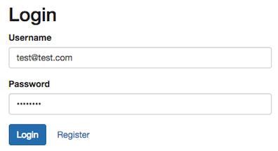</p>

**Passo 6** – Cognito irá detectar que esta é uma senha temporária e indicará que você precisa configurar uma nova senha para sua conta. Para fazer isso, a aplicação o redireciona para um novo formulário onde você irá configurar uma nova senha. Crie sua nova senha e selecione o botão **Confirm**. Lembre-se, sua nova senha deve estar alinhada com a política definida no Cognito anteriormente neste Lab (letras maiúsculas e minúsculas, ao menos um número e 8 caracteres ou mais).

<p align="center">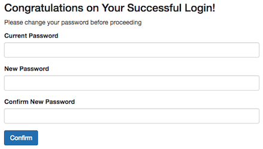</p>

**Passo 7** – Vamos confirmar que você pode autenticar utilizando sua conta recém criada. Insira seu usuário (endereço de email) e a senha que acabou de confirmar. Você agora será colocado na página de destino da aplicação. (O total dos painéis são falsos).

<p align="center">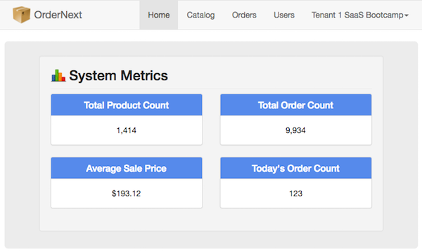</p>

**Passo 8** – Como um novo tenant no Sistema, você é criado como um 
**Tenant Administrador**. Isto lhe dá total controle do se ambiente de tenants. Isto também lhe dá a habilidade de criar novos usuários no seus sistema. Vamos tentar isto. Navegue para a opção de menu de **Usuários** no topo da página. Isto mostrará a lista atual de usuários no seus sistema. Você verá o usuário administrador inicial que o processo de registro de novos tenants criou. 

<p align="center"></p>

Agora selecione o botão **Add User** para adicionar um novo usuário ao seu sistema no papel de **Order Manager**. Crie um novo usuário (utilizando um diferente endereço de email/nome de usuário do seu tenant). Certifique-se de selecionar a papel **Order Manager**. Uma vez que você inseriu todos os dados, selecione o botão **Save** no final do formulário.

**Dica**: Você pode utilizar o mesmo endereço de email que usou para o tenant administrador porém adicione um simbolo de soma (**+**) e uma string unica depois do usuário e antes do símbolo **@**. (e.g. test@test.com -> test+user1@test.com). O servidor de email deve entregar essa mensagem endereçada para **test+user1** para a caixa de entrada do usuário **test**.

<p align="center">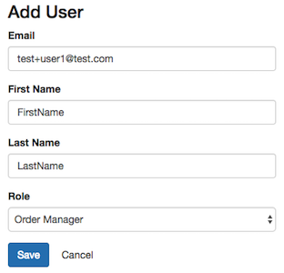</p>

**Passo 9** – O onboarding de novos usuários segue o mesmo fluxo que foi usado para registrar um novo tenant. Apertar o botão de salvar ativa o processamento do Cognito para generar um email que será enviado para o endereço de email que foi fornecido.

Selecione o menu suspenso com o nome do seu tenant no lado superior direito da tela e selecione **Logout**. Isto lhe levará de volta para a página de login.

<p align="center"></p>

Recupere o email com as credenciais temporárias para o usuário gerente de pedidos. Repita os mesmos passos que realizou acima para configurar uma nova senha e então faça login com o como o usuário gerente de pedidos. Você está agora na aplicação com o papel de “Order Manager” e não "Tenant Administrator". Você irá notar que opção de "Users" não está mais no menu e que você não mais possui a habilidade (para este usuário) de criar ou gerenciar usuários no sistema.
         
**Recap**: Este foi o ultimo passo para verificar que todos os elementos do ciclo de vida de onboarding e autenticação estão em vigor. Nós logamos de volta no sistema como nosso usuário tenant administrador e verificamos que a senha recém definida nos permite entrar na aplicação sem problemas. Nós também criamos um usuário descendente do nosso tenant e vimos que o fluxo de onboard era o mesmo e que a aplicação restringe acesso a determinadas funcionalidades de acordo com os atributos customizados que definimos no Cognito, como papel e camada.


## Parte 5 – Adquirindo Contexto de Tenant

Vimos como as nossas escolhas de sistema e arquitetura criam um processo de onboarding de tenant escalável, flexível, amigável para sua aplicação de SaaS. Agora, nós vamos ver em detalhes como exatamente nossa identidade SaaS do contexto de usuário e tenant autenticado combinado é intermediado por meio da aplicação utilizando um recurso do padrão OpenID Connect chamado declarações personalizadas. 

**Passo 1** – Retorne para a aplicação web e faça o login caso você não esteja conectado. Nós iremos usar a **Rede** da guia de **Ferramentas de Desenvolvedor** do seu navegador web para investigar os cabeçalhos de HTTP conforma a nossa aplicação invoca as REST APIs do nosso sistema. 

* Google Chrome
  * Clique nos 3 pontos verticais no final da barra de endereço -> Mais Ferramentas -> Ferramentas de Desenvolvedor -> Rede
* Mozilla Firefox
  * Clique em Ferramentas -> Desenvolvedor Web -> Rede
* Apple Safari
  * Safari Menu -> Preferências -> Avançado -> Mostrar Menu Desenvolver na barra de menus  -> Desenvolver -> Mostrar Inspetor Web -> Rede 

**Passo 2** – Enquanto olhamos para a **Rede** na guia de **Ferramentas de Desenvolvedor** do seu navegador, selecione a opção de menu **Usuários** na aplicação web. Selecione a segunda solicitação para `usuários` na lista de recursos e então expanda a seção **Cabeçalhos de Solicitações** na guia **Cabeçalho*. Um dos cabeçalhos de solicitações é o cabeçalho **Autorização**. É o valor nesse cabeçalho HTTP que nossos microsserviços aproveitam para integrar a identidade multi-tenant.

<p align="center">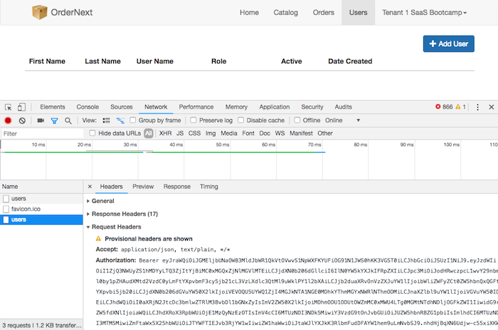</p>

**Passo 3** – Perceba que o cabeçalho **Autorização** consiste no termo **Portador** seguido de uma string codificada. Esse é o token de autorização, mais conhecido como **JSON Web Token** (JWT). Copie o token codificado em um editor de texto, e abra uma nova guia no website https://jwt.io/. Este website nos permitirá descodificar nosso token para investigar os metadados correspondentes no JWT.

<p align="center">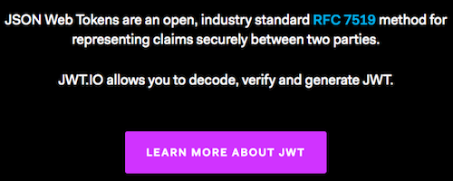</p>

**Passo 4** – Role a página para baixo e cole o token codificado na caixa de texto **Codificado** no meio do website. Esta pasta deve ter provocado uma decodificação do token. Perceba que na seção **Descodificado** do website, a seção **Carga Útil** contém pares de valores-chave descodificados, incluindo o endereço de **email** do usuário, bem como as **Reivindicações** personalizadas, como **custom:tenant_id** que nós configuramos como _imutável_ em nosso pool de usuários do Cognito na primeira parte desse Lab.

<p align="center">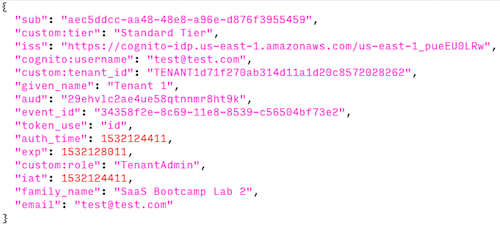</p>

**Recapitulando**: Essa parte mostrou como nós podemos aproveitar “declarações” personalizadas em nosso token de segurança para passar o contexto de tenant para cada invocação de API REST em nosso sistema. Nós estamos utilizando um mecanismo padrão do OpenID Connect que o Cognito (e muitos outros provedores de identidade) suporta para aumentar as informações do perfil do usuário com atributos personalizados. No próximo Lab do nosso bootcamp, nós vamos aprender como nossos microsserviços decodificam esse token de segurança WT e aplicam o contexto de tenant para nossa lógica de negócios.  

[Continue para o Lab 2](Lab2-pt-br.md)
