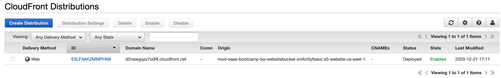

# Lab 1 – Tenant Onboarding

## Overview

For this first lab, we're going to look at what it takes to get tenants onboarded to a SaaS system. In many respects, onboarding is one of the most foundational aspects of SaaS. It creates the footprint of how tenants and users will be represented in our system, determining how tenants will be identified and conveyed as they flow through all the moving parts of our SaaS architecture. 

A key part of this process is to introduce the notion of a **SaaS Identity**. In many systems, the user's identity will be represented in an identity provider completely separate from its relationship to a tenant. A tenant is then somehow resolved as separate step. This adds overhead and complexity. Instead, in this lab, you'll see how to make a tighter binding between users and tenants that creates a combined user and tenant **SaaS identity** that we can then flow through the various services of our system. This allows tenant context to be promoted to a first-class construct and simplifies the implementation of services that need access to this context because they don't have to resolve tenant context as a separate step.

We'll first look at how users get introduced and represented in an identity provider. More specifically, we'll look at how **Amazon Cognito** can be configured to support the authentication and onboarding flows of our SaaS solution. We'll also use this opportunity to configure user attributes that let us create a connection between users and tenants. This will allow the Cognito authentication process to return authentication tokens that include embedded tenant context.

Once we have users setup, we'll turn our attention to how tenants get represented in our architecture. Tenants have their own profile and data that is configured separately from the users that are associated with that tenant. We'll introduce a microservice that owns the creation and management of these tenant attributes (tiering, status, policies, etc.).

With user and tenant management in place, we'll turn our attention to the end-user web application that acts as the front end to the onboarding system.

After onboarding a new tenant and an underprivileged user of that tenant using the web application, we'll look at how the orchestrating authentication and registration system uses the custom claims feature of the OpenID Connect standard to broker our SaaS Identity through security tokens in the HTTP headers.

By the end of Lab 1, all of the elements will be in place to onboard and authenticate tenants and their users. The diagram below highlights the key elements that are needed to support this experience.

<p align="center"></p>

At the top of the diagram is the web application that provides the user interface for our onboarding and authentication flows. This connects to the microservices via an API Gateway. Below the API Gateway are the various microservices needed to support these onboarding flows. Tenant Registration is the orchestrator of the onboarding process, invoking the User Manager (to create users in **Amazon Cognito**) and the Tenant Manager (to create tenants). The Authentication Manager authenticates users via the User Manager service.

### What You'll Be Building
As you progress through Lab 1 you'll be creating, configuring, and deploying the elements described above. The following is a breakdown of the steps that you'll be executing to get your SaaS onboarding and authentication experience off the ground:
* Create and Manage User Identity – For this scenario, we'll be using Cognito User Pools to manage users and handle user identity. In this part of the lab we'll take you through the steps to setup the Amazon Cognito environment.
* Create and Manage Users – Next, we'll examine the User microservice and see how it provides an abstraction API on top of Amazon Cognito. We'll exercise the User microservice by hand using the command line.
* Create and Manage Tenants – In part 3, we'll look at the features of the Tenant microservice and see how it maintains tenant level data separate from users. We'll exercise the Tenant microservice by hand using the command line.
* Orchestrated Onboarding – Finally, we'll launch the web UI experience and onboard a new tenant and its first admin user. This brings all the pieces together and shows how Cognito manages the heavy lifting of the authentication flow. We'll add a non-admin user to the same tenant and see how authorization compliments authentication to restrict access to certain features. We'll finish up by examining the underlying JWT technology used for security tokens.

## Part 1 - Create and Manage User Identity
Our goal for part 1 is to have you configure all the elements of Amazon Cognito by hand so that you understand all of the pieces that will be used by the full solution to onboard, manage, and authenticate users. We'll also introduce the ability to associate users with tenants, allowing us to create a **SaaS Identity**.

In this bootcamp, we'll be associating each tenant with a separate Cognito User Pool. The final solution creates these Cognito pools during onboarding. Each pool is configured the same way to apply the onboarding and identity settings of our tenants.

**Step 1** - Navigate to the Amazon Cognito service in the AWS Console and select **Manage User Pools** from the Cognito Screen.

<p align="center"></p>

**Step 2** - Select **Create A User Pool** from the top right of the Cognito console.

<p align="center"></p>

**Step 3** – You will be presented with a user pool creation experience (shown below) that is used to configure all of the elements of your identity and onboarding experience. The first step in this process is to give your pool a name. Choose any name you'd like (e.g. **SaaS Bootcamp Users**).

<p align="center"></p>

**Step 4** - Select **Step through settings** to configure the pool to support the onboarding experience we want our SaaS users to have.

The first step allows us to configure the attributes of the pool. Let's start by looking at the sign-in policies. The screen below represents the options you'll have.

<p align="center"></p>

Here we're specifying what options a user can have for their unique identifier (their email in this circumstance). For our solution, we'll check the **Also allow sign in with a verified phone number** option.

**Step 5** – Now we move on to the standard attributes portion of the user pool configuration. You are presented with a collection of standardized attributes that are managed by Cognito. Select the **email**, **family name**, **given name**, **phone number**, and **preferred username** attributes. You may recognize these attributes as OpenID Connect standard claims.

<p align="center"></p>

**Step 6** – Now we will get more SaaS specific as we turn our attention to configuring the custom attributes of our user pool. This is where we introduce attributes that connect users to tenants. When we provision tenants, we'll persist these additional attributes as part of each user's profile. This same data will also be embedded in the tokens that are returned by the authentication process. 

Scroll down the page and click **Add custom attribute** under the "Do you want to add custom attributes?" heading.

<p align="center"></p>

Add the following tenant attributes, clicking **Add another attribute** for each new attribute to be added: 
* **tenant_id** (string, default max length, _**not**_ mutable)
* **tier** (string, default max length, mutable)
* **company_name** (string, default max length, mutable)
* **role** (string, default max length, mutable)
* **account_name** (string, default max length, mutable)

Attributes are case-sensitive. Your screen should appear as follows:

<p align="center"></p>

**Step 7** – Once you've finished configuring the custom attributes, click the **Next step** button at the bottom of the screen. This takes us to the policies page.

Here we can configure password and administration policies. These policies (and others configured with user pools) allow us to vary the approach of each tenant. You could, for example, surface these choices in the tenant administration experience of your SaaS solution, allowing individual tenants to configure their own policies.

<p align="center"></p>

For our solution, we'll override a couple of the default options.

First, let's turn off the **Require special character** option for our password policies. Also, select the **Only allow administrators to create users** option to limit who can create new users in the system. The figure above provides a snapshot of the user pool configuration screen with these options configured.

Once you've completed this section, click the **Next step** button at the bottom of the page.

**Step 8** – We're now at the MFA and verifications section. For Some SaaS providers, or even individual tenants, it could be valuable to enable MFA. For this solution, though, _**we'll leave it disabled**_. Don't change anything on this screen.

This page gives us the option to configure how verifications will be delivered. For this lab _**we'll leave the default settings**_.

If you choose to enable phone number verification or MFA, Cognito would need an IAM role for permissions to send an SMS message to the user via Amazon SNS. **For this lab, just click the "Next step" button**.

**Step 9** – The 4th step in the wizard is the **Message customizations** page. As part of our onboarding process, we'll be sending emails to users to verify their identity. We can lean on Cognito for this functionality as well. This screen lets us configure how this verification process will work. _For this bootcamp, we will use the default verification message settings_.

Scroll down the page to the "**Do you want to customize your user invitation messages?**" section. Customize the invitation email that will be sent by Cognito as each new tenant signs up as follows:

Change the subject from "Your temporary password" to "**New SaaS Bootcamp Tenant**" and the **Email message** text to:

```html
 <br><br>
Welcome to the SaaS on AWS Bootcamp. <br><br>
Login to the SaaS system. <br><br>
Username: {username} <br><br>
Password: {####}.
```

<p align="center"></p>

Cognito also has the ability to customize some of the email headers for your verification and invitation emails. We'll leave these settings alone for this bootcamp. Click on the **Next step** button.

**Step 10** – For this bootcamp we will _skip over_ the **Tags** and **Devices** sections. Just click the **Next step** button _**twice**_ to advance to the **App clients** screen.

**Step 11** – Now that we have the fundamentals of our user pool created, we need to create an application client for this pool. This client is a fundamental piece of Cognito. It provides the context through which we can access the _unauthenticated_ flows that are required to register and sign in to the system. You can't login to a page that requires you to be logged in. You can imagine how this is key to our onboarding experience. Select the **Add an app client** link from the following screen:

<p align="center"></p>

**Step 12** – Now we can configure the new application client. Enter a name for your client (e.g. **SaaS App Client**), and uncheck the three boxes **Generate client secret**, **Enable lambda trigger based custom authentication (ALLOW_CUSTOM_AUTH)**, and **Enable SRP (secure remote password) protocol based authentication (ALLOW_USER_SRP_AUTH)**.

The client secret option on this screen refers to an OAuth 2.0 client secret. This is not used for "public" (web or mobile) applications where a user will be entering their credentials.

Once you've made these changes, select the **Create app client** button and then the **Next step** button to continue the wizard.

<p align="center"></p>

**Step 13** – For this bootcamp we will _skip over_ the **Triggers** section. Scroll to the bottom of the screen and click the **Next step** button to advance to the final review screen and click **Create pool**.

**Step 14** – Before moving on, we'll want to record both the id that was generated for this User Pool and the App client id. Copy and paste the **Pool Id** value from the **General Settings** screen into a temporary file or open the next step in a separate web browser window or tab. Also, select the **App clients** tab from the left-hand list and save your **App client id**. We will use both of these values in a subsequent step.

<p align="center"></p>

<p align="center"></p>

**Step 15** – The user pool portion is complete. Before we can use this user pool we'll need to connect it with an **Identity Pool**. Cognito Identity Pools provide the mechanism to exchange a User Pool authenticated token for a set of AWS access keys that control access to AWS resources such as S3 buckets or DynamoDB tables.

To setup your identity pool, navigate back to the main page of Cognito by selecting the AWS icon in the upper left and then selecting Cognito again from the list of services. Select the **Manage Identity Pools** button.

<p align="center"></p>

**Step 16** – The Getting started wizard should launch for you to create a new identity pool because you don't have any existing pools to list. Enter the name of your new identity pool (e.g. **SaaS Identity Pool**).

<p align="center"></p>

**Step 17** – Expand the **Authentication Providers** section at the bottom of the screen by clicking on the triangle. Here's where we'll create the connection between our user pool and the identity pool. You'll see a collection of tabs here representing the various identity providers that Cognito supports. We'll use the first tab, **Cognito**. You'll see options here to enter the User Pool ID as well as the App client id that were captured above. If you didn't copy them down before, you can access them from the attributes of the user pool you created above.

<p align="center"></p>

**Step 18** – Select the **Create Pool** button from the bottom right of the page to trigger the creation of the pool. 

**Step 19** – Finally, select the **Allow button** on the next page to enable your new identity pool to access AWS resources. This will complete the creation process.

**Recap**: At this point, you have all the moving parts in place for your SaaS system to manage users and associate those users with tenants. We've also setup the policies that will control how the system validates users during onboarding. This includes the definition of password and username policies. The last section setup an identity pool to enable authenticated access to AWS resources.

## Part 2 - Managing Users
While we've configured the AWS infrastructure to support the management of our user identities with Cognito, we still need some mechanism that allows our application to access and configure these elements at runtime. To get there, we need to introduce a microservice that will sit in front of the Cognito APIs. This both encapsulates our user management capabilities and simplifies the developer experience, hiding away the details of the Cognito API.

Instead of building this microservice from scratch, we're going to simply review the sample code deployed as a Docker container image to **Amazon Elastic Container Service** (ECS).

**Step 1** – Let's crack open the code and take a closer look at what's here. To simplify this bootcamp experience, and make sure everyone has the command line tools necessary to follow along, we have provisioned an **AWS Cloud9** Integrated Development Environment (IDE) for you.

To get started with Cloud9, choose it from the AWS Console under the **Development Tools** category. A screen listing your available IDEs will be displayed. Click on the **Open IDE** button in the **SaaS Bootcamp IDE** tile to launch Cloud9 in a new browser tab.

<p align="center"></p>

**Step 2** – When your Cloud9 IDE launched, it automatically cloned the GitHub repository for this bootcamp and you should see a folder tree on the left-hand side with the `aws-saas-factory-bootcamp` folder listed. Expand this tree and navigate to the `source/user-manager` folder. Double-click on the **server.js** file to open it in the editor pane. This file is a **Node.js** file that uses the **Express** web application framework to implement a REST API for managing users. Below is a list of some of the entry points that may be of interest for this onboarding flow.

```javascript
app.get('/user/pool/:id', function(req, res) {...});
app.get('/user/:id', function(req, res) {...});
app.get('/users', function(req, res) {...});
app.post('/user/reg', function(req, res) {...});
app.post('/user/create', function(req, res) {...});
app.post('/user', function(req, res) {...});
app.put('/user', function(req, res) {...});
app.delete('/user/:id', function(req, res) {...});
```

These represent HTTP entry points into the user manager service and include basic CRUD (create, read, update, delete) operations, as well as functionality to support registration and fetch Cognito User Pool data for a given username.

**Step 3** – Since Cognito will serve as the repository to store our users, the user manager service must make calls to the Cognito API to persist new users that are created in the system. To illustrate this, let's take a closer look at an initial version of the POST method in user manager that will create new users in Cognito. You'll see that our `app.post` method gets a JSON formatted user object from the request body that is then passed along to our Cognito user pool via the createUser method from the Cognito SDK.

```javascript
app.post('/user/create', function (req, res) {
    var newUser = req.body;
    
    var credentials = {};
    tokenManager.getSystemCredentials(function (systemCredentials) {
        if (systemCredentials) {
            credentials = systemCredentials;
        
            cognitoUsers.createUser(credentials, newUser, function(err, cognitoUsers) {
                if (err) {
                    res.status(400).send('{"Error": "Error creating new user"}');
                } else {
                    res.status(200).send(cognitoUsers);
                }
            });

        } else {
            res.status(400).send('{"Error": "Could not retrieve system credentials"}');
        }
    });
});
```

**Step 4** – Now that have a clearer view of what's happening behind the scenes, let's make a call to this REST service to create a user in the **Cognito User Pool** we created for our tenant.

To achieve this, you'll need the Invoke URL of the **API Gateway** that our microservice is behind and the **Pool Id** from Cognito that you saved earlier when setting up the User Pool.

Navigate to the **API Gateway** console listed under the **Networking** heading in the AWS console. Select the **saas-bootcamp-api** API. In the left-hand menu, select the **Stages** link. At the top of the deployed stages tree, you should see a **v1** stage for "version 1". Click on this and in the main area of your screen, you will see the **Invoke URL** for this deployed API Gateway stage. For example:

<p align="center"></p>

**Step 5** – If you need to retrieve your user pool id again, navigate to the Cognito service in the AWS console and select the **Manage User Pools** button. You will be presented with a list of user pools that have been created in your account. Select the user pool that you created earlier to display information about the user pool.

<p align="center"></p>

**Step 6** – After you've selected the pool, you'll be presented with a summary page that identifies the attributes of your user pool. The data you're after is the **Pool Id**, which is shown at the top of the page (similar to what is shown below).

<p align="center"></p>

**Step 7** – Now that you have the pool id and the invoke URL, you're ready to call the REST method on the user manager service to create a user in Cognito. To call our REST entry point, we'll need to invoke the create user POST method. You can do this via a variety of tools (cURL, Postman, etc.). We will use the terminal command line available in Cloud9.

The Cloud9 Welcome screen will be open as a tab in the editor pane. _Below_ the code editor pane you should see a series of command line tabs. You can use an existing command line or open a new terminal window by clicking on the green plus button and choose **New Terminal** or use the keyboard shortcut `Alt/Opt-T`.

<p align="center"></p>

Use the Cloud9 terminal command line to invoke the REST command to create a new user. Copy and paste the following command (be sure to scroll to select the entire command), replacing **USER-POOL-ID** with the pool id you captured from the Cognito User Pool settings and **INVOKE-URL** with the URL you captured from the API Gateway stage settings.

```bash
curl -w "\n" --header "Content-Type: application/json" --request POST --data '{"userPoolId": "USER-POOL-ID", "tenant_id": "999", "userName": "test@test.com", "email": "test@test.com", "firstName": "Test", "lastName": "User", "role": "tenantAdmin", "tier": "Advanced"}' INVOKE-URL/user/create
```

On success, the newly created user object will be returned in JSON format.

**Step 8** – You can now verify that your new user was created in the Cognito user pool. Once again, let's return to the Cognito service in the AWS console. After selecting the service, select **Manager User Pools** and select the user pool created above to drill into that pool.

Select **Users and groups** from the menu on the left. When you select this option, you'll see the list of users in your pool. You may have to click the small refresh icon in the upper right corner to see all users.

<p align="center"></p>

**Step 9** – Your newly added user should appear in this list. Select the link for your username to get more detailed information about the user. You'll see how you user landed in the system with the tenant, name, and email address you provided via your REST command.

<p align="center"></p>

**Recap**: In this part we introduced the AWS Cloud9 IDE for ease in viewing the bootcamp sample source code and for its built-in Linux terminal command line tools. We investigated how we built a User Management Service in a microservices architecture to abstract away the details of the Cognito API. You also were able to see how the user management service created new users in your user pool.

While we've focused here on performing user pool and user creation as manual step, the final version of this solution will automate the creation of the user pool for each tenant during onboarding.

## Part 3 - Managing Tenants

At this point, we have a way to create users as part of the onboarding process. We also have a way to associate these users with tenants. What we're missing is some ability to store and represent tenants.

Tenants must be represented and managed separate from users. They have policies, tiers, status, and so on —- all of which should be managed through a separate contract and service.

Fortunately, the management of this service is relatively straightforward. It simply requires a CRUD (create, read, update, delete) microservice that will manage data stored in a DynamoDB table.

**Step 1** – The Tenant Manager Service has also been deployed to an ECS Fargate container as a Node.js microservice. It too has a REST API and we can exercise it via the command line just as we did the User Manager Service.

Submit the following command to create a new tenant. Copy and paste the following command (be sure to scroll to select the entire command), replacing **INVOKE-URL** with the URL you captured from the API Gateway stage settings.

```bash
curl -w "\n" --header "Content-Type: application/json" --request POST --data '{"tenant_id": "111", "role": "tenantAdmin", "company_name": "Test SaaS Tenant", "tier": "Advanced", "status": "Active"}' INVOKE-URL/tenant
```

**Step 2** – Let's check that our tenant was saved to the database. Navigate to the DynamoDB service in the AWS console and select the **Tables** option from the navigation list in the upper left-hand side of the page.

<p align="center"></p>

**Step 3** – Locate and select the **TenantBootcamp** table hyperlink from the list of DynamoDB tables and then select the **Items** tab to view the data in the table.

<p align="center"></p>

You should see an item in the table containing all the attributes you submitted via the cURL command.

**Recap**: The goal of this section was merely to introduce you to the tenant manager service and the separate representation of tenant data. The **tenant_id** in this DynamoDB table will be associated with one or more users via the **tenant_id** custom attribute that we created as a custom attribute in the Cognito user pool. By separating the unique tenant data out from our user attributes, we have a clear path for how tenants are managed and configured.

## Part 4 - The Onboarding & Authentication Application

All of the microservices are deployed and the backend infrastructure pieces are in place to support the onboarding process. Now we'll look at the application that can engage the services to onboard and authenticate tenants. We won't dig too far into the details of the web application. It's a relatively straightforward AngularJS application that is hosted on **Amazon S3**.

It's important to note that the rules and mechanics of this onboarding workflow reflect the policies and settings choosen when the user pool is created in Cognito. Validation mechanisms and password policies, for example, will be enforced and orchestrated by Cognito.

**Step 1** – Before we open up the web application, let's take a look at a sample from the UI code that will be invoking the REST services that we covered above. The code that follows is taken from the `register.js` controller found at `source/web-client/app/scripts/controllers/register.js`.
When the registration form is filled out and the user selects the **Register** button, the system will invoke the following snippet of code:

```javascript
$scope.formSubmit = function () {
    if (!($scope.tenant.email || $scope.tenant.companyName)) {
        $scope.error = "User name and company name are required. Please enter these values.";
    } else {
        var tenant = {
            tenant_id: '',
            companyName: $scope.tenant.companyName,
            accountName: $scope.tenant.companyName,
            ownerName: $scope.tenant.email,
            tier: $scope.tenant.plan,
            email: $scope.tenant.email,
            userName: $scope.tenant.email,
            firstName: $scope.tenant.firstName,
            lastName: $scope.tenant.lastName
        };

        $http.post(Constants.TENANT_REGISTRATION_URL + '/reg', tenant)
                .then(function (data) {
                    console.log('Registration success');
                    $scope.hideRegistrationForm = true;
                    $scope.showSuccessMessage = true;
                })
                .catch(function (response) {
                    $scope.error = "Unable to create new account";
                    console.log('Registration failed: ', response);
                });
    }
};
```

Notice that we copy the contents of the HTML form and construct a JSON `tenant` object that holds all the attributes of our new tenant. Then, we make the REST call that POSTs this JSON tenant data to the tenant registration service. The registration service orchestrates calls to the user manager and tenant manager to provision all the elements of the tenant footprint.

**Step 2** – Our web application is considered static because it uses JavaScript to modify the HTML views directly on the browser without having to reload the entire URI from the server. **Amazon S3** provides for _serverless_ hosting of static websites. To minimize geographic delay in loading your website and to offload HTTPS encryption, we've put an Amazon CloudFront distribution in front of the S3 bucket hosting our website. We need to capture the URL of our application from CloudFront.


Navigate to the **CloudFront** service under the **Networking & Content Delivery** category in the AWS console. A distribution has been created for our web application. Copy the **Domain Name** and open it in a new web browser window or tab.

<p align="center"></p>

**Step 3** – The landing page for the application will prompt you to login. This page is for tenants that have already registered. You don't have any tenants yet, so, you'll need to select the **Register** button (to the right of the **Login** button). Selecting this button will take you to a form where you can register your new tenant.

<p align="center"></p>

Enter the data for your new tenant and its initial admin user. The key value here is your email address. _You must enter an email address where you can access the messages_ that will be used to complete this registration process. The remaining values can be as you choose. This will be the first tenant in your system and we will create another in the next lab.

The "Plan" value is simply included to convey that during onboarding is where you would capture the different tiers of your product offering.

Once you complete the form, select the **Register** button and after a second or two you'll be presented with message indicating that you have registered and should be receiving an email to validate your identity.

**Step 4** – Now check your email for the validation message that was sent by Cognito. You should find a message in your inbox that includes your username (your email address) along with a temporary password (generated by Cognito). The message will be similar to the following:

<p align="center"></p>

**Step 5** – We can now login to the application using these credentials. Return to the application using the URL provided above and you will be presented with a login form. Enter the temporary credentials that were provided in the Cognito validation email and select the **Login** button.

<p align="center"></p>

**Step 6** – Cognito will detect that this is a temporary password and indicate that you need to setup a new password for your account. To do this, the application redirects you to a new form where you'll setup your new password. Create your new password and select the **Confirm** button. Remember, your new password must conform to the policy you defined in Cognito earlier in this Lab (upper and lower letters and at least 1 number and 8 characters or more in length).

<p align="center"></p>

**Step 7** – Let's confirm that you can authenticate with your newly created account. Enter your username (email address) and the password you just confirmed. You will now be placed at the landing page of the application. (The dashboard totals are fake).

<p align="center"></p>

**Step 8** – As a new tenant to the system, you are created as a **Tenant Administrator**. This gives you full control of your tenant environment. It also gives you the ability to create new users in your system. Let's try that. Navigate to the **Users** menu option at the top of the page. This will display the current list of users in your system. You'll see the initial admin user the tenant registration process created.

<p align="center"></p>

Now select the **Add User** button to add a new user to your system in the **Order Manager** role. Create the new user (using a different email address/username) than your tenant. Be sure to select the **Order Manager** role. Once you've entered all the data, select the **Save** button at the bottom of the form.

**Hint**: You can use the same email address as you used for your tenant admin but add a plus symbol (**+**) and unique string after the username but before the at (**@**) symbol (e.g. test@test.com -> test+user1@test.com). The email server should also deliver this message addressed to **test+user1** to the **test** user's inbox.

<p align="center"></p>

**Step 9** – The onboarding of new users follows the same flow that was used to register a new tenant. Pressing the save button triggers Cognito's processing to generate an email that will be sent to the email address that was provided.

Select the dropdown menu with your tenant name at the top right of the screen and select **Logout**. This will return you to the login page.

<p align="center"></p>

Retrieve the email with the temporary credentials for the order manager user. Repeat the same steps you did above to set a new password and then login as the order manger user. You're now in the application with the role of "Order Manager" not "Tenant Administrator". You'll notice that the "Users" option is gone from the menu and you no longer have the ability (for this user) to create or manage users in the system.

**Recap**: This was the last step in verifying that all the elements of the onboarding and authentication lifecycle are in place. We logged back into the system as our tenant administrator user and verified that the newly set password would let us into the application un-challenged. We also created a user as a child of our tenant and saw that the onboarding flow was the same and that the application restricts access to certain functionality by the custom attributes we defined in Cognito such as role and tier.

## Part 5 - Acquiring Tenant Context

We have now seen how our system and architecture choices create a scalable, flexible, and user-friendly tenant onboarding process for our SaaS application. Now we will look at the nuts and bolts of how exactly our SaaS Identity of combined authenticated user and tenant context is brokered through the application using a feature of the OpenID Connect standard called custom claims.

**Step 1** – Return to the web application and login if you aren't already. We will use the **Network** tab of the **Developer Tools** from your web browser to investigate the HTTP headers as our application invokes the REST APIs of our system.

* Google Chrome
  * Click the 3 vertical dots at the end of the address bar -> More Tools -> Developer Tools -> Network
* Mozilla Firefox
  * Click Tools -> Web Developer -> Network
* Apple Safari
  * Safari Menu -> Preferences -> Advanced -> Show Develop menu in menu bar -> Develop -> Show Web Inspector -> Network

**Step 2** – While looking at the **Network** tab of your browser's **Developer Tools**, select the **Users** menu option in the web application. Select the 2nd request for `users` in the list of resources and then expand the **Request Headers** section in the **Headers** tab. One of the request headers is the **Authorization** header. It's the value in this HTTP header that our microservices leverage to integrate multi-tenant identity.

<p align="center"></p>

**Step 3** – Notice, that the **Authorization** header consists of the term **Bearer** followed by an encoded string. This is the authorization token, better known as a **JSON Web Token** (JWT). Copy the encoded token into a text editor, and open a new tab to the website https://jwt.io/. This website will allow us to decode our token to investigate the corresponding metadata within the JWT.

<p align="center"></p>

**Step 4** – Scroll down the page and paste the encoded token into the **Encoded** text box in the middle of the website. This paste should have triggered a decoding of the token. Notice in the **Decoded** section of the website, the **PAYLOAD** section contains decoded key value pairs including the **email** address of the user, as well as the custom **Claims** such as **custom:tenant_id** which we configured as _immutable_ within our Cognito User Pool in the first part of this Lab.

<p align="center"></p>

**Recap**: This part showed how we can leverage custom "claims" within our security token to pass along tenant-context to each REST API invocation in our system. We are utilizing a standard mechanism from OpenID Connect which Cognito (and many other identity providers) support to augment user profile information with custom attributes. In the next lab of our bootcamp, we will learn how our microservices decode this JWT security token and apply the tenant context to our business logic.

[Continue to Lab 2](Lab2.md)
