# Lab 2 – Building Multi-Tenant Microservices

### Overview

In our first lab, we focused all of our attention on getting tenants onboarding and creating a true notion of **SaaS Identity** where user identity was joined to a tenant identity. With those elements in place, we can now turn our attention to thinking about how we actually build the services and functionality of our application in a multi-tenant fashion. This means applying the tenant identity and context with the services that we build.

So far, the services that we've created (tenant registration, user management, etc.) have all been about the fundamentals of onboarding. Now, let's look at the services that we'll introduce to support the actual functionality of our application. For this scenario, we're building a very basic order management system. It lets you create a product catalog and place orders against that catalog. It's important to note, that as a pooled isolation SaaS solution the compute and storage resources used to implement this functionality will be shared by all tenants.

Below is a high level diagram of the services that will be delivering this functionality:

<p align="center">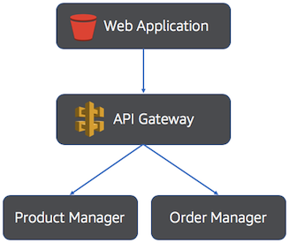</p>

This is a very basic diagram that highlights the services and their interactions with the other aspects of the bootcamp's architecture. Notice that these services are connected to the web application via the **API Gateway**, exposing basic **CRUD** operations to create, read, update, and delete both products and orders.

Of course as part of implementing these services, we have to think about what must be done to apply multi-tenancy to these services. These services will need to store data, log metrics, and acquire user identity all with multi-tenant awareness. So, we have to think about how this is achieved and applied within these services.

Below is a diagram that provides a conceptual view of what it means to build a multi-tenant aware microservice:

<p align="center">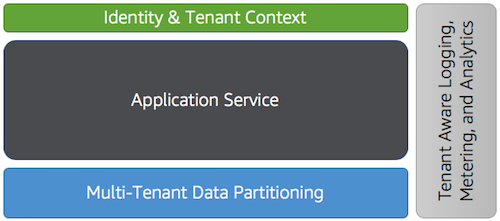</p>

This somewhat simplified diagram highlights the key areas we're going to focus on for the multi-tenant microservices we'll be deploying. At the center of the diagram are the actual services being built (in our case the product and order managers). Surrounding it are the areas where we need to factor in multi-tenancy. These include:

* **Identity and Tenant Context** – our services need some standard way to acquire the current user's role and authorization along with the tenant context. Almost every action within your services happens in the context of a tenant so we'll need to think about how we acquire and apply that context.
* **Multi-Tenant Data Partitioning** – our two services will need to store data. This means our storage CRUD operations will all need some injection of tenant context to figure out how to partition, persist, and acquire data in a multi-tenant model.
* **Tenant Aware Logging, Metering, and Analytics** – as we record logs and metrics about activity in our system, we'll need some way to attribute those activities to a specific tenant. Our services must inject this context into any activity messages that are published for troubleshooting or downstream analytics.
 
This backdrop provides you with a view of the fundamental concepts that we'll explore in this lab. While we won't be writing services from scratch, we'll be highlighting how a service will evolve to incorporate these concepts.

### What You'll Be Building
To demonstrate the multi-tenant concepts, we'll go through an evolutionary process where we gradually add multi-tenant awareness to our solution. We'll start with a single-tenant version of our product manager service, then progressively add the bits needed to make this a fully multi-tenant aware service. The basic steps in this process include:
* Deploy a single-tenant product manager microservice – this is a baseline step to illustrate what the service looks like before we begin to layer on the elements of multi-tenancy. It will be a basic CRUD service with no multi-tenant awareness.
* Introduce multi-tenant data partitioning – the first phase of multi-tenancy will be to add the ability to partition data based on a tenant identifier supplied as part of an incoming request.
* Extract tenant context from user identity – add the ability to use the security context of HTTP calls into the service to extract and apply tenant identity for our data partitioning scheme.
* Introduce a second tenant to demonstrate partitioning – register a new tenant and manage products through that tenant context to illustrate how the system has successfully partitioned the data in the application.

## Part 1 - Deploying a Single-Tenant Product Manager Service

Before we can see how multi-tenancy influences the business services of our application, we need to see a baseline single-tenant service in action. This will provide a foundation for our exploration of multi-tenancy, illustrating how multi-tenancy influences the implementation of our microservice.

In this basic model, we'll deploy a service, create a **DynamoDB** table to hold our product data, then use cURL from the command line to exercise this new service.

**Step 1** - Let's start this process by taking a closer look at the single-tenant service that we'll be deploying. Like the prior services implemented in the first lab, the product manager microservice is built with Node.js and Express. It exposes a series of CRUD operations via a REST interface.

The source code for this file is available at `Lab2/Part1/product-manager/server.js`.

In looking at this file, you'll see a number of entry points that correspond to the REST methods (`app.get(...)`, `app.post(...)`, etc.). Within each of these functions is the implementation of the corresponding REST operation. Let's take a look at one of these methods in more detail to get a sense of what's going on here.

```javascript
app.get('/product/:id', function (req, res) {
    winston.debug('Fetching product: ' + req.params.id);
    // init params structure with request params
    var params = {
        product_id: req.params.id
    };
    tokenManager.getSystemCredentials(function (credentials) {
        // construct the helper object
        var dynamoHelper = new DynamoDBHelper(productSchema, credentials, configuration);
        dynamoHelper.getItem(params, credentials, function (err, product) {
            if (err) {
                winston.error('Error getting product: ' + err.message);
                res.status(400).send('{"Error" : "Error getting product"}');
            } else {
                winston.debug('Product ' + req.params.id + ' retrieved');
                res.status(200).send(product);
            }
        });
    });
});
```

Let's start by looking at the signature of the method. Here you'll see the traditional REST path for a GET method with the `/product` resource followed by an identifier parameter that indicates which product is to be fetched. This value is extracted from the incoming request and populated into a `params` structure. The rest of this function is about calling our DynamoDBHelper, which is our data access layer, to fetch the item from a DynamoDB table.

**Step 2** - Our first step is to deploy the single-tenant product manager, within our Cloud9 IDE. Navigate to `Lab2/Part1/product-manager` directory, right-click `deploy.sh`, and click **Run** to execute the shell script.

<p align="center">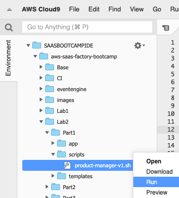</p>

**Step 3** - Wait for the `deploy.sh` shell script to execute successfully.

<p align="center">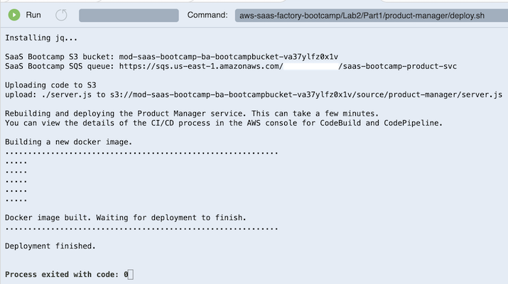</p>

**Step 4** - Now that our service is deployed, we have to introduce its supporting elements. Let's start by creating the DynamoDB table that will be used to store product information. First, navigate to the DynamoDB service in the AWS console and select the **Tables** option from the navigation list in the upper left-hand side of the page.

<p align="center">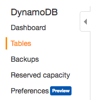</p>

**Step 5** - Now click the **Create table** button at the top of the page. Enter a table name of **ProductBootcamp** and enter **product_id** as the primary key. The table and key names are case sensitive in DynamoDB. Be sure you enter the values correctly. Once you've filled out the form, select the **Create** button at the bottom right of the page to create your new table.

<p align="center">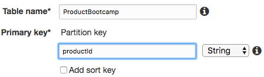</p>

**Step 6** - At this point the table should be created and your service should be running and accessible via the **Amazon API Gateway**. First, we need the API Gateway URL that exposes our microservices. Navigate to API Gateway in the AWS console and select the **saas-bootcamp-api** API.

<p align="center">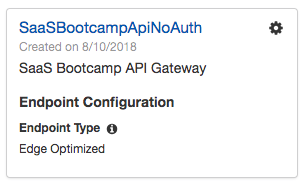</p>

**Step 7** - Select **Stages** from the left-hand menu and then click on the **v1** (version 1) stage. The invocation URL will be displayed. This is the base URL (_including **/v1** at the end_) that all of your microservices will be accessible from.

<p align="center">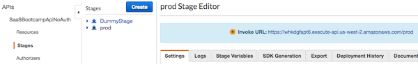</p>

**Step 8** - Now let's verify that the basic plumbing of our Product Manager service is in place by making a simple call to its health check endpoint. For this step and subsequent steps, you can use either **cURL** or Postman (or the tool of your choice). Let's invoke the GET method on `/product/health` to verify that the service is running. Copy and paste the following command, replacing **INVOKE-URL** with the URL and trailing stage name you captured from the API Gateway settings.

```bash
curl -w "\n" --header "Content-Type: application/json" INVOKE-URL/product/health
```

**Be sure you've included the API stage name at the end of the URL _before_ /product/health**. You should get a JSON formatted success message from the **cURL** command indicating that the request was successfully processed and the service is ready to process requests.

**Step 9** - Now that we know the service is up-and-running, we can add a new product to the catalog via the REST API. Submit the following REST command to create your first product. Copy and paste the following command (be sure to scroll to select the entire command), replacing **INVOKE-URL** with the URL and trailing stage name you captured from the API Gateway settings.

```bash
curl -w "\n" --header "Content-Type: application/json" --request POST --data '{"sku": "1234", "title": "My Product", "description": "A Great Product", "condition": "Brand New", "conditionDescription": "New", "numberInStock": "1"}' INVOKE-URL/product
```

**Step 10** - Let's now go verify that the data we submitted landed successfully in the DynamoDB table we created. Navigate to the DynamoDB service in the AWS console and select **Tables** from the list of options at the upper left-hand side of the page. The center of the page should now display a list of tables. Find your **ProductBootcamp** table and select the link with the table name. This will display basic information about the table. Select the **Items** tab from the top of the screen, you'll see the list of items in your product table, which should include the item you just added.

<p align="center">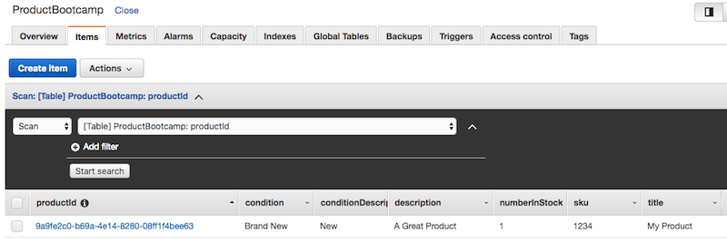</p>

**Recap**: This initial exercise illustrates a single-tenant version of the product manager service. It does not have identity or tenant context built into the service. In many respects, this represents the flavor of service you'd see in many non-SaaS environments. It gives us a good base for thinking about how we can now evolve the service to incorporate multi-tenant concepts.

## Part 2 - Adding Multi-Tenant Data Partitioning

The first step in making our service multi-tenant aware is to implement a partitioning model where we can persist data from multiple tenants in our single DynamoDB database. We'll also need to inject tenant context into our REST requests and leverage this context for each of our CRUD operations.

To make this work, will need a different configuration for our DynamoDB database, introducing a tenant identifier as the partition key. We'll also need a new version of our service that accepts a tenant identifier in each of the REST methods and applies it as it accesses DynamoDB tables.

The steps that follow will take you through the process of adding these capabilities to the product manager service:

**Step 1** - For this iteration, we'll need a new version of our service. While we won't modify the code directly, we'll take a quick look at how the code changes to support data partitioning. Open our product manager server.js file in our Cloud9 IDE. In Cloud9, navigate to `Lab2/Part2/product-manager/`, right-click `server.js` and click **Open**.

<p align="center">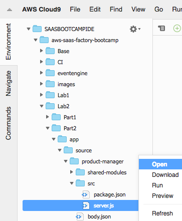</p>

This file doesn't look all that different than our prior version. In fact, the only change here is that we've added a tenant identifier to the parameters that we supply to the DynamoDBHelper. Below is a snippet of the code from our file.

```javascript
app.post('/product', function(req, res) {
	var product = req.body;
	var guid = uuidv4();
	product.product_id = guid;
	product.tenant_id = req.body.tenant_id;
	winston.debug(JSON.stringify(product));
	// construct the helper object
	tokenManager.getSystemCredentials(function(credentials) {
		var dynamoHelper = new DynamoDBHelper(productSchema, credentials, configuration);
		dynamoHelper.putItem(product, credentials, function(err, product) {
			if (err) {
				winston.error('Error creating new product: ' + err.message);
				res.status(400).send('{"Error": "Error creating product"}');
			} else {
				winston.debug('Product ' + req.body.title + ' created');
				res.status(200).send({status: 'success'});
			}
		});
	});
});
```

The line `product.tenant_id = req.body.tenant_id;` represents the only change you'll see between this version and the original. It extracts the tenant identifier from the incoming request and adds it to our product object. This, of course, means that REST calls to this method must supply a tenant identifier with each invocation of this method.

**Step 2** - Up to this point, we haven't really looked at the **DynamoDBHelper** to see how it accommodates our ability to get items from the DynamoDB table. This module is a wrapper of the AWS-provided DynamoDB client with some added elements to support isolation. In fact, even as we're introducing this tenant identifier model, it does not change how DynamoDBHelper processes this request. Below is a snipped of code from the DynamoDBHelper for the `getItem()` method:

```javascript
DynamoDBHelper.prototype.getItem = function(keyParams, credentials, callback) {
    this.getDynamoDBDocumentClient(credentials, function (error, docClient) {
        var fetchParams = {
            TableName: this.tableDefinition.TableName,
            Key: keyParams
        }
        docClient.get(fetchParams, function(err, data) {
            if (err) {
                winston.debug(JSON.stringify(docClient.response));
                callback(err);
            } else {
                callback(null, data.Item);
            }
        });
    }.bind(this));
}
```

You'll notice that we're passing through all the parameters that we constructed in our product manager service as the `keyParams` value in the `fetchParams` structure. The client will simply use the parameters to match the partition key for the table. The takeaway here is that nothing unique is done in the code to support the partitioning by a tenant identifier. It's simply just another key in our DynamoDB table.

**Step 3** - Now that you have a better sense of how this service changes to accommodate data partitioning, let's go ahead and deploy version 2 of the product manager, within our Cloud9 IDE. Navigate to `Lab2/Part2/product-manager` directory, right-click `deploy.sh`, and click **Run** to execute the shell script.

<p align="center">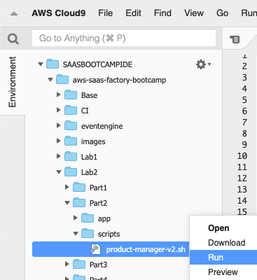</p>

**Step 4** - Wait for the `deploy.sh` shell script to execute successfully.

<p align="center"></p>

**Step 5** - With this new partitioning scheme, we must also change the configuration of our DynamoDB table. If you recall, the current table used **product_id** as the partition key. We now need to have **tenant_id** be our partition key and have the **product_id** serve as a secondary index (since we may still want to sort on that value). The easiest way to introduce this change is to simply **_delete_** the existing **ProductBootcamp** table and create a new one with the correct configuration.

Navigate to the DynamoDB service in the AWS console and select the **Tables** option from the menu at the top left of the page. Select the radio button for the **ProductBootcamp** table. After selecting the product table, select the **Delete table** button. You will be prompted to confirm removal of CloudWatch alarms to complete the process.

<p align="center">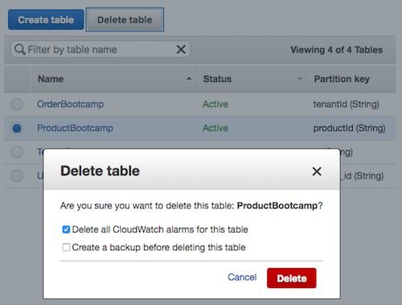</p>

**Step 6** - Now we can start the table creation process from scratch. Select the **Create table** button from the top of the page. As before, enter **ProductBootcamp** for the table name, but this time enter **tenant_id** for the partition key. Now click on the **Add sort key** checkbox and we'll enter **product_id** as the sort key. Click the **Create** button to finalize the table.

<p align="center">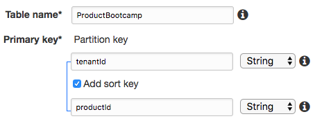</p>

**Step 7** - The service has now been modified to support the introduction of a tenant identifier and we've modified DynamoDB to partition the data with this tenant identifier. It's time now to validate that the new version of the service is up-and-running. Issue the following cURL command to invoke the health check on the service. Refer to Part 1 if you need to find your API Gateway URL. Copy and paste the following command, replacing **INVOKE-URL** with the URL and trailing stage name you captured from the API Gateway settings.

```bash
curl -w "\n" --header "Content-Type: application/json" INVOKE-URL/product/health
```
**Be sure you've included the API stage name at the end of the URL before /product/health.** You should get a JSON formatted success message from the **cURL** command indicating that the request was successfully processed and the service is ready to process requests.

**Step 8** - Now that we know the service is up-and-running, we can add a new product to the catalog via the REST API. Unlike our prior REST call, this one must provide the tenant identifier as part of the request. Submit the following REST command to create a product for tenant "**123**". Copy and paste the following command (be sure to scroll to select the entire command), replacing **INVOKE-URL** with the URL and trailing stage name you captured from the API Gateway settings.

```bash
curl -w "\n" --header "Content-Type: application/json" --request POST --data '{"tenant_id": "123", "sku": "1234", "title": "My Product", "description": "A Great Product", "condition": "Brand New", "conditionDescription": "New", "numberInStock": "1"}' INVOKE-URL/product
```

This looks much like the prior example. However, notice that we pass a parameter of `tenant_id` ("123") in the body.

**Step 9** - Before we verify that this data was successfully written, let's introduce another product for a different tenant. This will highlight the fact that our partitioning scheme can store data separately for each tenant. To add another product for a different tenant, we just issue another POST command for a different tenant. Submit the following POST for tenant "**456**". Copy and paste the following command (be sure to scroll to select the entire command), replacing **INVOKE-URL** with the URL and trailing stage name you captured from the API Gateway settings.

```bash
curl -w "\n" --header "Content-Type: application/json" --request POST --data '{"tenant_id": "456", "sku": "1234", "title": "My Product", "description": "A Great Product", "condition": "Brand New", "conditionDescription": "New", "numberInStock": "1"}' INVOKE-URL/product
```

**Step 10** - Let's go verify that the data we submitted landed successfully in the DynamoDB table we created. Navigate to the DynamoDB service in the AWS console and select **Tables** from the list of options at the upper left-hand side of the page. The center of the page should now display a list of tables. Find your **ProductBootcamp** table and select the link with the table name. This will display basic information about the table. Now select the **Items** tab from the top of the screen and you'll see the list of items in your table which should include the two items you just added. Verify that these two items exist and are partitioned based on the two tenant identifiers that you suppled ("123" and "456").

<p align="center">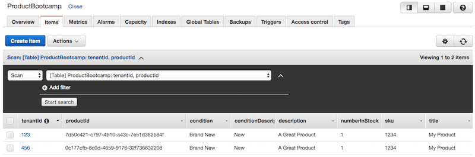</p>

**Recap**: You've now successfully introduced data partitioning into your service. The microservice achieved this by adding a tenant identifier parameter to the product manager service and changing the product table to use **tenant_id** as the partition key. Now, all of your CRUD operations are multi-tenant aware.

## Part 3 - Applying Tenant Context

At this stage we have data partitioning, but our way of introducing the tenant context was somewhat crude. It's simply not practical or secure to expect that tenant identifiers are to be passed as a parameter to every call to the product management service. Instead, this tenant context should come from the tokens that are part of the authentication process that we setup in the prior lab.

So, our next step is to enable our service to be aware of these security tokens and extract our tenant context from these tokens. Then, our partitioning that we just setup can rely on a tenant identifier that was provisioned during onboarding and simply flowed through to your product manager service in the header of each HTTP request.

For this section, we'll see how our product manager service gets retrofitted with new code to extract these tokens from the HTTP request and applies them to our security and data partitioning model.

**Step 1** - For this iteration, we'll need a new version of our service. While we won't modify the code directly, we'll take a quick look at how the code changes to support acquiring tenant context from identity tokens. View the new version of our Product Manager service in Cloud9 by opening `Lab2/Part3/product-manager/server.js`.

<p align="center">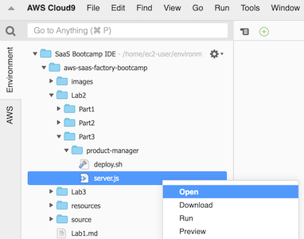</p>

Version 3 of our product manager service introduces a new **TokenManager** helper object that abstracts away many aspects of the token processing. Let's take a look at a snippet of this updated version to see how tenant context is acquired from the user's identity:

```javascript
app.use(function (req, res, next) {
    res.header("Access-Control-Allow-Origin", "*");
    res.header("Access-Control-Allow-Methods", "GET, POST, OPTIONS, PUT, PATCH, DELETE");
    res.header("Access-Control-Allow-Headers", "Content-Type, Access-Control-Allow-Headers, Authorization, X-Requested-With");
    bearerToken = req.get('Authorization');
    if (bearerToken) {
        tenantId = tokenManager.getTenantId(req);
    }
    next();
});
```

The TokenManager's `getTenantId` function shown here, which appears in most of the services of our application, provides the mechanism for acquiring the tenant identifier from the **HTTP headers** for each REST request. It achieves this by using the middleware construct of the Express framework. This middleware allows you to introduce a function that intercepts and pre-processes each HTTP request before it is processed by the functions for each REST method.

You'll see after the response headers are set, the bearer token is extracted from the **HTTP Authorization** header. This token holds the data we want to use to acquire our tenant context. We then use the **TokenManager** helper to get the tenant identifier out of the request. The call to this function returns the tenant identifier and assigns it to the `tenantId` variable. This variable is then referenced throughout the service to acquire tenant context.

**Step 2** - Now that you have the tenant identifier, the application of this is relatively straightforward. You can see that we've changed the way we're acquiring the tenant identifier, referencing the **tenantId** that we extracted from the bearer token in the middleware in Step 1 (instead of pulling this from the incoming requests).

```javascript
app.get('/product/:id', function(req, res) {
	winston.debug('Fetching product: ' + req.params.id);
	// init params structure with request params
	var params = {
		tenant_id: tenantId,
		product_id: req.params.id
	};
	tokenManager.getSystemCredentials(function(credentials) {
		// construct the helper object
		var dynamoHelper = new DynamoDBHelper(productSchema, credentials, configuration);
		dynamoHelper.getItem(params, credentials, function(err, product) {
			if (err) {
				winston.error('Error getting product: ' + err.message);
				res.status(400).send('{"Error": "Error getting product"}');
			} else {
				winston.debug('Product ' + req.params.id + ' retrieved');
				res.status(200).send(product);
			}
		});
	});
});
```

**Step 3** - As you can imagine, most of the token processing work here is intentionally embedded in the helper class. Let's take a quick look at what is in that class to see how it's extracting this context from the tokens.

Below is a snippet of the code from the TokenManager that is invoked to extract the token. This function extracts the security token from the Authorization header of the HTTP request, decodes it, then acquires the tenantId from the decoded token. _In a production environment, this unpacking would use a signed certificate as a security measure to ensure the token contents were not modified during transmission_.

```javascript
module.exports.getTenantId = function(req) {
    var tenantId = '';
    var bearerToken = req.get('Authorization');
    if (bearerToken) {
        bearerToken = bearerToken.substring(bearerToken.indexOf(' ') + 1);
        var decodedIdToken = jwtDecode(bearerToken);
        if (decodedIdToken) {
            tenantId = decodedIdToken['custom:tenant_id'];
        }
    }
    return tenantId;
}
```

**Step 4** - Now that you have a better sense of how we've introduced tenant context through HTTP headers, let's go ahead and deploy version 3 of the product manager, within our Cloud9 IDE. Navigate to `Lab2/Part3/product-manager/` directory, right-click `deploy.sh`, and click **Run** to execute the shell script.

<p align="center"></p>

**Step 5** - Wait for the `deploy.sh` shell script to execute successfully.

<p align="center">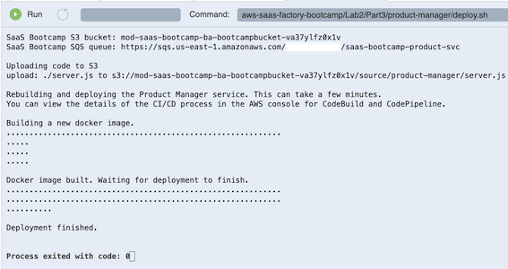</p>

**Step 6** - Now that the application is deployed, it's time to see how this new tenant and security context gets processed. We'll need to have a valid token for our service to be able to succeed. That means returning our attention to the web application, which already has the ability to authenticate a user and acquire a valid token from our identity provider, Cognito. First, we'll need to make sure we have at least two tenants registered.

You already registered a tenant in Lab 1. Let's add a second tenant following the same steps as in Lab 1. Enter the URL to your application (created in Lab 1) and select the **Register** button when the login screen appears. Refer to Lab 1 if you need to capture the URL for your application from the **CloudFront** service.

**Step 7** - Fill in the form with data about your new tenant. Since we're creating two tenants as part of this flow, you'll need **two separate** email addresses. If you don't have two, you can use the same trick with the plus (**+**) symbol in the username before the at (**@**) symbol as described in Lab 1. After you've filled in the form, select the **Register** button.

**Step 8** - Just like in Lab 1, you'll now check your email for the validation message that was sent by Cognito. You should find a message in your inbox that includes your username (your email address) along with a temporary password (generated by Cognito). The message will be similar to the following:

<p align="center"></p>

**Step 9** - We can now login to the application using these credentials. Return to the application using the public URL (created in Lab 1). Enter the temporary credentials that were provided in your email and select the **Login** button.

<p align="center"></p>

**Step 10** - The system will detect that this is a temporary password and indicate that you need to setup a new password for your account. To do this, application redirects you to a new form where you'll setup your new password (as shown below). Create your new password and select the **Confirm** button.

<p align="center"></p>

After you've successfully changed your password, you'll be logged into the application and landed at the home page. We won't get into the specifics of the application yet.

**Step 11** - You must have two tenants to finish the lab exercises. If you only have one tenant registered, create another by repeating steps 6-10 again, supplying a different email address for your tenant.

**Step 12** - Now that our tenants have been created through the onboarding flow let's actually create some products via the application. Log into the application as your first tenant and navigate to the **Catalog** menu item at the top of the page.

<p align="center">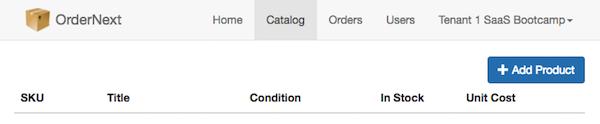</p>

**Step 13** - With the **Catalog** page open, select the **Add Product** button from the top right of the page. Fill in the details with the product data of your choice. However, for the **SKU**, precede all of your SKU's with **TENANTONE**. So, SKU one might be "**TENANTONE-ABC**". The key here is that we want to have _specific_ values that are prepended to your SKU that clearly identify the products as belonging to this specific tenant.
<p align="center">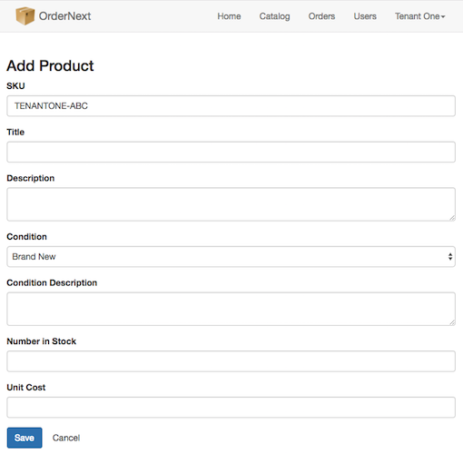</p>

**Step 14** - Once you've added a couple of products for one of your tenants, select the dropdown menu with your tenant name at the top right of the screen and select **Logout**. This will return you to the login page.

<p align="center">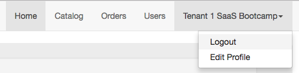</p>

**Step 15** - Enter the credentials of the other tenant that you created and select the **Login** button. You're now logged in as a different tenant and you should see a different name in the profile menu selection in the upper right of the screen.

**Step 16** - Now navigate to the **Catalog** view again. You should note that the list of products is empty at this point. The products that you previously created were associated with another tenant so they are intentionally not show here. **The illustrates that our partitioning is working**.

**Step 17** - As before, click the **Add Product** button to fill in the details with the product data of your choice. However, for the SKU, precede all of your SKU's with **TENANTTWO**. So, SKU one might be **TENANTTWO-ABC**. The key here is that we want to have _specific_ values that are prepended to your SKU that clearly identify the products as belonging to this specific tenant.

<p align="center">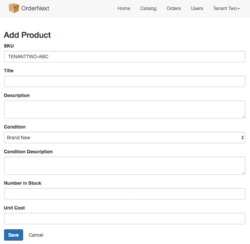</p>

**Step 18** - After completing this onboarding process and adding these products for two separate tenants, we can now go see how this data landed in DynamoDB tables that support this experience.

Navigate to the **DynamoDB** service in the AWS console and select **Tables** from the list of options at the top left of the page. Select the **ProductBootcamp** table and then the **Items** tab. Notice that the table is partitioned by `tenant_id`. You should be able to see the products you entered through the web application while logged in as the 2 different tenants (separate from the products you entered via the REST API earlier in the lab).

<p align="center">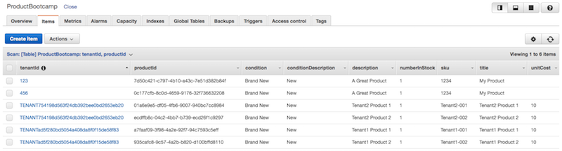</p>

**Step 19** - If you review the **TenantBootcamp** table, you should see entries for the tenants you onboarded through the web application and their automatically generated GUIDs in the **tenant_id** field will match the **tenant_id** field in the entries in the **ProductBootcamp** table.

**Recap**: You've now elevated the mechanism of acquiring tenant context in our microservices by extracting our custom "claims" from the security token passed in the Authorization HTTP header. We reduced developer complexity in applying the tenant context by creating a custom TokenManager helper class that takes advantage of the Express framework's "middleware" concept to intercept all incoming requests prior to executing a REST resource's method.

[Continue to Lab 3](Lab3.md)
