# Lab 3 – Isolamento dos dados dos tenants

### Visão Geral

Até aqui, nós abordamos muitos dos elementos centrais do modelo de arquietura SaaS. Mas um ponto que ainda não entramos foi o isolamento entre tenants. No papel de um provedor de SaaS, você deve fazer todo o possível para garantir que os recursos e dados de cada tenant estão protegidos de qualquer tipo de acesso entre tenants. Isso é um desafio quando esses tenants estão compartilhando elementos de infraestrutura. Se, por algum motivo, um tenant conseguir acessar o ambiente de outro tenant, isso pode causar problemas para um negócio baseado em SaaS.

Para lidar com esse caso, nós devemos ir além da autenticação básica. Devemos introduzir políticas e controles de acesso que garantem que estamos fazendo todo o possível para isolar e proteger os ambientes dos tenants. Até mesmo em ambientes SaaS onde os recursos não são compartilhados, temos que tomar medidas adicionais para garantir que minimizamos a exposição à acessos entre tenants.

Para este bootcamp, vamos focar em como isolar os dados residentes nas tabelas do DynamoDB. Especificamente, queremos ver como podemos isolar os dados do tenant que residem nas tabelas de produto e pedido, que armazenam dados da aplicação. Para conseguirmos, precisamos considerar como foi feito o particionamento dos dados. Abaixo temos um diagrama que mostra o esquema de particionamento das tabelas de produto e pedido.

<p align="center">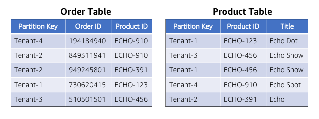</p>

Nessa imagem de exemplo, você pode ver que temos dados de múltiplos tenants em uma mesma tabela. Então, se alguém tiver acesso a uma dessas tabelas, teremos acesso aos dados de qualquer um dos tenants.

Nosso objetivo é implementar um modelo de segurança que pode limitar o acesso a essas tabelas de forma granular no nível do item armazenado. Ou seja, queremos montar uma visão da tabela que restringe o acesso à apenas os itens que são válidos para um tenant em específico.

Para esse bootcamp, vamos utilizar uma combinação de Amazon Cognito, Amazon Identity and Access Management (IAM) e AWS Security Token Service (STS) para limitar o acesso à essas tabelas. Isso irá conectar diretamente com a noção de identidade SaaS que discutimos anteriormente, através dos tokens que utilizamos para linkar um usuário à um conjunto de políticas.

Existem duas fases importantes para implementar esse modelo de isolamento. Primeiro, quando os tenants são provisionados incialmente, precisamos criar um conjunto de IAM roles para cada tenant. Para cada role que existe no ambiente do tenant, precisamos criar políticas que restringem o acesso ao recurso do sistema específico daquele tenant. Abaixo temos uma representação conceitual desse processo de onboarding e como são criadas as roles para cada tenant.

<p align="center">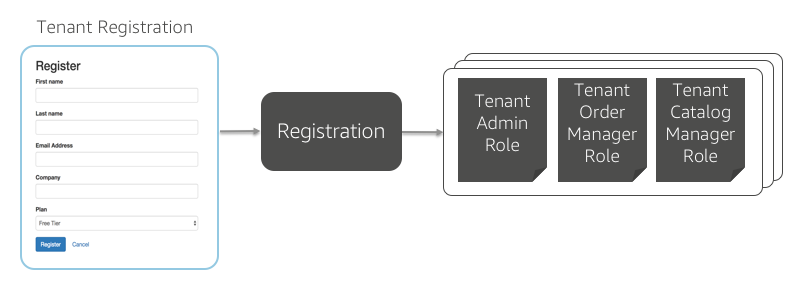</p>

Na esquera, temos o processo de registro que criamos no Lab 1. Na direita, temos conjuntos de políticas que são geradas (por trás dos panos) para cada role. É importante notar que não é necessário ter roles separadas para cada usuário. Ao invés disso, as roles serão aplicadas para todos os usuários daquele tenant.

A segunda fase do isolamento acontece quando estamos acessando recursos através do nosso código. O diagrama abaixo ilustra as peças desse processo.

<p align="center">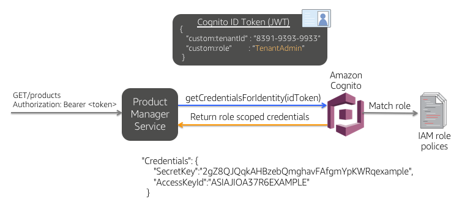</p>

Nesse exemplo, podemos ver que o serviço gerenciador de produtos é chamado pela interface com uma requisição para obter uma lista de produtos. O token JWT obtido durante a autenticação é passado no header Authorization da requisição HTTP. Esse token contém informações sobre a identidade do usuário, role e identidade do tenant. Embora esse token é valioso para passar atributos do usuário e do tenant, ele não faz nada para controlar o acesso do tenant aos recursos. **Assim, precisamos usar os _dados_ contidos nesse token para obter as credenciais com escopo de acesso às tabelas do DynamoDB.**

O restante do diagrama ilustra como essas credenciais restritas são obtidas. Uma vez que a requisição `GET` chega no nosso sistema de gerenciamento de produtos, ele faz uma chamada `getCredentialsForIdentity()` para o Cognito, passando o token. O Cognito irá abrir o token e comparar o identificador do tenant e role do usuário e corresponder com uma das políticas que foram criadas durante o provisionamento. O Cognito irá criar um conjunto de credenciais **temporárias** (mostradas em baixo) através do STS e as retornará para o serviço gerenciador de produtos. O serviço vai usar essas credenciais temporárias para acessar as tabelas do DynamoDB com a certeza de que essas credenciais irão restringir o acesso _pelo tenant id_.

### O que você irá construir
O objetivo desse exercício é passar pela configuração e criação de alguns elementos que são parte desse processo. Embora os conceitos acima nos ajudam a entender o cenário, vamos ver alguns detalhes de como esses conceitos são aplicados na solução de referência. Vamos começar ao introduzir as políticas durante o provisionamento e como configurar o Cognito para conectar essas políticas às roles de usuário. Por fim, vamos ver como isso é implementado no código da aplicação. Os passos básicos desse processo incluem:

* **Exemplo de acesso entre tenants** - primeiro você verá como, sem políticas e restrições, um desenvolvedor pode criar uma situação que viola os limites entre tenants do sistema.
* **Configurar as políticas do IAM provisionadas** - agora que você viu um exemplo de acesso entre tenants, vamos começar a introduzir políticas para prevenir acessos entre tenants (devidos ou indevidos). Você criará uma política para diferentes combinações entre role/recurso para ver como essas políticas são usadas para limitar o acesso às tabelas do DynamoDB. Você então provisionará um novo tenant e verá como essas políticas são representadas no IAM.
* **Mapear roles de usuário para políticas** - com o Cognito, podemos criar regras que determinam como a role de um usuário será mapeada para as políticas que criamos. Nessa perte, você verá como essas políticas foram configuradas para nosso tenant e roles dos usuários.
* **Adquirir credenciais limitadas a um tenant** - por fim, você verá como orquestrar a aquisição das credenciais que são limitadas pelas poíticas descritas acima. As credenciais vão controlar o acesso aos dados. Você verá como isso explicitamente impõe limites ao acesso entre tenants.

Com esse componente instalado, você terá adicionado um mecanismo robusto à solução que limita e controla o acesso aos recursos dos tenants. Essa solução ilustra uma de várias estratégias que podem ser aplicadas para garantir o isolamento entre tenants.

## Parte 1 - Exemplo de acesso entre tenants
Antes de introduzirmos as **políticas**, é interessante examinar um cenário onde a ausência de controles de segurança adequados podem introduzir acessos a dados de tenants diferentes. Vamos ver um exemplo (de certa forma complicado) onde um desenvolvedor pode adicionar um código que possivelmente permita um acesso entre tenants.

Para fazer isso, vamos voltar ao serviço de gerenciamento de produtos e ver como o contexto de tenant injetado manualmente pode trazer dados da sua aplicação que não deveriam ser obtidos. Esse será o pano de fundo para entender como a introdução de **políticas** podem prevenir isso de acontecer.

**Passo 1** - No [Lab 2](Lab2.md), nós adicionamos produtos aos catálogos para cada um dos tenants. Se você não possui dois tenants registrados até aqui, com pelo menos um produto cada, por favor, siga os passos descritos no Lab 2 para ter esse pré-requisito completo.

Para criar um acesso entre tenants, mesmo que artificial, precisamos dos identificadores únicos para os tenants. Vamos encontrar os identificadores para cada um dos tenants. Vá até o **DynamoDB**, na console da AWS, e clique na opção **Tables** localizado no canto superior esquerdo da página. Selecione a tabela **TenantBootcamp** e então clique na aba **Items**.

<p align="center">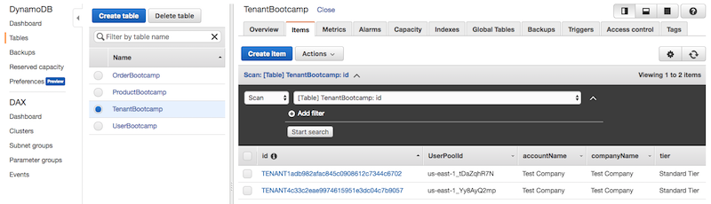</p>

**Passo 2** - Localize na lista os dois tenants que você criou que você criou comparando com o nome de usuário/email que você utilizou para criá-los. **Copie o valor do tenant_id para esses dois tenants.** Você irá precisar desses valores nos passos a seguir.
 
**Passo 3** - Agora vamos voltar ao código do serviço gerenciador de produtos e fazer uma modificação. Abra o arquivo `server.js` na IDE Cloud9. No Cloud9, vá até `Lab3/Part1/product-manager/`. Abra o arquivo no editor, clicando duas vezes no arquivo `server.js` ou então clicando com o botão direito no arquivo e clicando em **Open**.

<p align="center">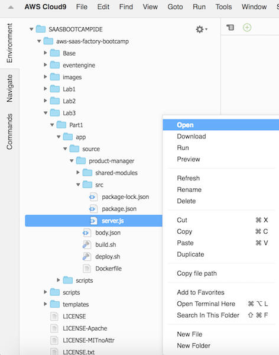</p>

**Passo 4** - Localize a função `GET` responsável por pegar todos os produtos de um tenant. O código será o seguinte:

```javascript
app.get('/products', function(req, res) {
	var searchParams = {
		TableName: productSchema.TableName,
		KeyConditionExpression: "tenant_id = :tenant_id",
		ExpressionAttributeValues: {
			":tenant_id": tenantId
			//":tenant_id": "<INSERT TENANT TWO GUID HERE>"
		}
	};
	// construct the helper object
	tokenManager.getSystemCredentials(function(credentials) {
		var dynamoHelper = new DynamoDBHelper(productSchema, credentials, configuration);
		dynamoHelper.query(searchParams, credentials, function(error, products) {
			if (error) {
				winston.error('Error retrieving products: ' + error.message);
				res.status(400).send('{"Error": "Error retrieving products"}');
			} else {
				winston.debug('Products successfully retrieved');
				res.status(200).send(products);
			}
		});
	});
});
```
Essa função é chamada pela aplicação para obter uma lista de produtos que populam a página de catálogo do sistema. Você pode ver que ela faz referência ao `tenant_id` que foi extraído do token de segurança passado para nossa aplicação. Agora, vamos considerar o que aconteceria se nós **manualmente trocássemos** esse `tenant_id` com outro valor. Localize o `tenant_id` que você anotou para o **TenantTwo** e **_substitua_** o `tenant_id` por esse valor. Então, quando você tiver concluído, o código deve ser semelhante ao seguinte:

```javascript
app.get('/products', function (req, res) {
    winston.debug('Fetching Products for Tenant Id: ' + tenantId);
    var searchParams = {
        TableName: productSchema.TableName,
        KeyConditionExpression: "tenant_id = :tenant_id",
        ExpressionAttributeValues: {
            ":tenant_id": "TENANT4c33c2eae9974615951e3dc04c7b9057"
        }
    };
    // construct the helper object
    tokenManager.getSystemCredentials(function (credentials) {
        var dynamoHelper = new DynamoDBHelper(productSchema, credentials, configuration);
        dynamoHelper.query(searchParams, credentials, function (error, products) {
            if (error) {
                winston.error('Error retrieving products: ' + error.message);
                res.status(400).send('{"Error" : "Error retrieving products"}');
            } else {
                winston.debug('Products successfully retrieved');
                res.status(200).send(products);
            }

        });
    });
});
```

**Passo 5** - Agora precisamos implantar o microsserviço gerenciador de produtos com o código que realiza acessos indevidos entre tenants. Primeiramente, salve o arquivo `server.js` modificado no Cloud9: clique em **File** na barra de ferramentas, seguido de **Save**.

<p align="center">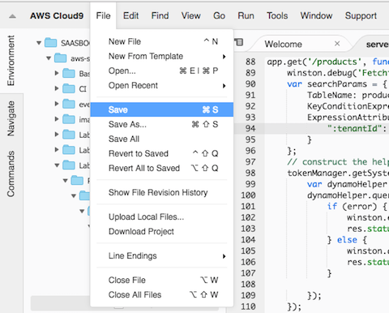</p>

**Passo 6** - Para implantar o serviço, vá até o diretório `Lab3/Part1/product-manager/` e clique com o botão direito em `deploy.sh`, em seguida clique em **Run** para executar o shell script.

<p align="center">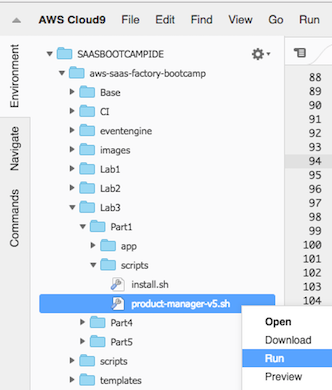</p>

**Passo 7** - Aguarde a execução com sucesso do shell script `deploy.sh`.

<p align="center">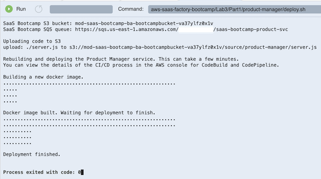</p>

**Passo 8** - Com a nova versão do serviço implantada, agora podemos ver como isso impactou a aplicação. Vamos acessar o sistema usando as credenciais do **TenantOne** que você criou anteriormente. (se o **TenantTwo** ainda estiver logado, saia usando o menu do lado superior direito da página).

**Passo 9** - Selecione a opção **Catalog** no menu do topo da página. Ela _deveria_ mostrar o catálogo do **TenantOne** para o usuário que você acabou de se autenticar. No entanto, a **_lista contém os produtos que são do TenantTwo_**. Nós oficialmente cruzamos os limites entre tenants.

**Recap**: O que podemos concluir dessa parte do laboratório é que apenas a autenticação não é suficiente para proteger seu sistema SaaS. Sem políticas adicionais e um mecanismo de autorização, o código do seu sistema poderia acessar dados de outros tenants de forma não intencional. Aqui nós forçamos essa condição explicitamente, mas você pode imaginar que outras mudanças mais sutis feitas por um desenvolvedor podem ter um efeito colateral indesejado.

## Parte 2 - Configurando políticas do IAM


Agora nós precisamos de políticas para melhor proteger nosso sistema crontra acesso cruzado. A questão é: o que podemos fazer para isolar e proteger melhor os dados do tenant? A primeira parte do quebra-cabeça é **políticas do IAM**. Com as políticas do IAM, nós podemos criar regras que controlam o nível de acesso que cada usuário tem aos recursos do tenant.

Ao invés de criar novas políticas do zero, vamos editar políticas já criadas durante o começo do nosso processo. 

Os seguitnes passos irão guiá-lo através do processo de edição das políticas:

**Passo 1** - Para localizar as políticas que queremos editar, navegue até o serviço do IAM na console da AWS, e selecione **Policies** da lista de opções na superior esquerda da página. Isso dará a você uma lista de todas as políticas disponíveis no IAM.

**Passo 2** - Agora, nós queremos encontrar as políticas associadas aos dois tenant que criamos (**TenantOne** e **TenantTwo**). Vamos começar com o TenantOne. Precisamos digitar o nome da política na caixa de pesquisa no topo da tela. Digite o GUID do tenant TenantOne. Você obteve essa informação previamente no DynamoDB.

<p align="center">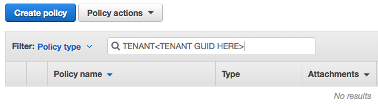</p>

**Passo 3** - A lista agora deve ser reduzida a apenas 2 políticas para o tenant one. Haverão a política para o tenant **administrador** e uma segunda para o tenant **usuário**. **Selecione o triângulo/seta** na coluna que precede o nome da política **TenantAdmin** para examinar em detalhes a política. Então, selecione o botão **Edit policy** que está próximo ao centro da página.

<p align="center">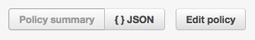</p>

**Passo 4** - A console agora mostrará uma lista de políticas do DynamoDB e do Cognigno User Pool. Nós estamos interessados em editar a política para a tabela **ProductBootcamp**. Entretanto, _sua localização nessa lista de tabelas do DynamoDB pode variar_. Abra cada uma das entradas colapsadas do DynamoDB na lista **selecionando a seta** do lado esquerdo da borda da lista. Perto da parte inferior de cada conjunto expandido de políticas, você deverá encontrar um seção **Resources**. Localize o conjunto de políticas que fazem referência a tabela **ProductBootcamp**. O ARN será similar ao seguinte:

<p align="center"></p>

**Passo 5** - Nosso interesse é no **Request conditions** associado a essa política. Essas condições são o coração da nossa habilitade de controlar que itens um usuário pode acessar na tabela do Dynamo. Queremos que nossa política indique que apenas usuários com valor de chave de partição que corresponda ao identificador do tenant de **TenantOne** terão permissão para acessar esses itens na tabela. Expanda a seção de **Request conditions** e **selecione o texto da condição** isso colocará em modo de edição para as condições.

<p align="center">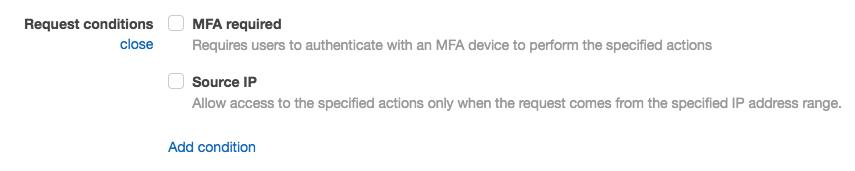</p>

**Passo 6** - Selecione opção **Add condition** na parte de baixo da lista. Selecione **dynamodb:LeadingKeys** para o **Condition key**. Selecione **For all values in request** para o campo **Qualifier**. Selecione **StringEquals** para o campo **Operator**. Finalmente, no campo de texto **Value**, digite o GUID do **TenantOne**. Clique no botão **Add**. Selecione o botão **Review policy** e então selecione o botão **Save Changes** para salvar as mudanças na política.

<p align="center">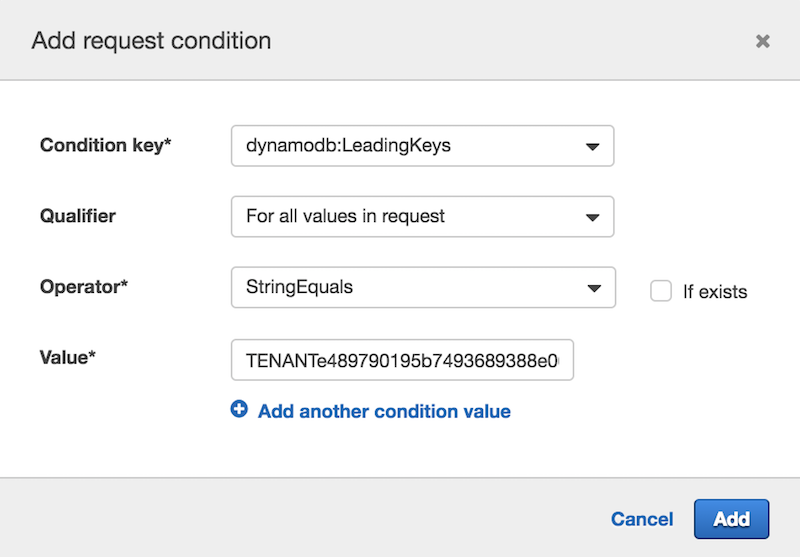</p>

Este processo criou uma nova **request condition** para nossa política que agora indica a qual o valor da chave de partição do DynamoDB deve corresponder ao identificador do tenant quando o usuário tentar acessar os itens da tabela.

**Passo 7** - Agora queremos repetir esse mesmo processo para o **TenantTwo**. Complete os passos de 2-6 substituindo todas as referências ao TenantOne com **TenantTwo**. Isso garantirá que o TenantTwo também estará protegido.

**Recapitulando**: Os exercícos desta parte do laboratório mostraram como implementar os elementos necessários para apoiar nossos objetivos de isolamento de tenant. Alteramos nossas **políticas** de tenant introduzindo mudanças que nos permitem definir o escopo do acesso às tabelas do DynamoDB. Isso foi possível adicionando uma nova condição às nossas políticas de tabela ProductBootcamp. Essas políticas, que são específicas do tenant, limitam a visão do usuário da tabela apenas aos itens que contêm nosso identificador de tenant na chave de partição da tabela.

## Parte 3 - Mapeando roles de usuários para políticas

Agora que definimos as políticas, precisamos de algum jeito de conectar essas políticas com as roles de usuários específicas. Nós precisamos de uma maneira de criar uma correspondência entre a role do usuário e o escopo do tenant para um conjunto _específico_ de políticas. Para este cenário, vamos ter o apoio das **capacidade do mapeamento de roles do Cognito**. O Cognito nos permitirá definir um conjunto de condições que serão usadas para criar essa correspondência e, no processo, emitir um **conjunto de credenciais** que será escopo com base nas políticas correspondente - que é exatamente o que precisamos para implementar nosso modelo de isolamento de tenant. 

Neste bootcamp, esses mapeamentos de política já foram criados. Vamos dar uma olhada nelas na **console do Cognito**.

**Passo 1** - Navegue até o Cognito na console da AWS. Na página inicial, selecione o botão **Manage Identity Pools**  para ver a lista de identity pools. A lista incluirá **pool separados** para cada tenant que você realizou o onboarding.

Localize os identity pools para o **TenantOne** e **TenantTwo**. Eles estarão nomeados com o GUID do tenant. Clique no identity pool que é associado com o **TenantOne**.

<p align="center">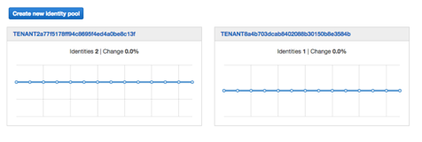</p>

**Passo 2** - Uma vez selecionado o identity pool, você vê a página que fornece um resumo da atividade do identity pool. Agora selecione o link **Edit identity pool** no topo direito da página.

<p align="center">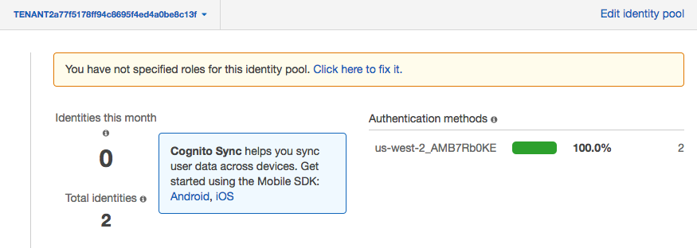</p>

**Passo 3** - Se você rolar para baixo a página de edição do identity pool, você verá uma seção para **Authentication Providers**. Expanda essa seção, e você verá uma página com configurações do provedor de autorização. 

Você pode ver os mapeamentos de roles em funcionamento para nossas duas roles. Há uma role **TenantAdmin** que representa o administrador e uma role **TenantUser** que mapeia usuários não administradores para cada um do seus sistemas SaaS. Naturalmente, esses tem diferentes níveis de acesso ao sistema e dos recursos.

A coluna de claim tem um valor (URL codificado) que corresponde ao atributo customizado **role** que configuramos no Cognito no Lab 1. Quando esse **claim customizado corresponde** ao nome da role, a política do IAM (com as restrições para o DynamoDB) é aplicada nos **tokens de segurança temporários retornados pelo STS**.

<p align="center">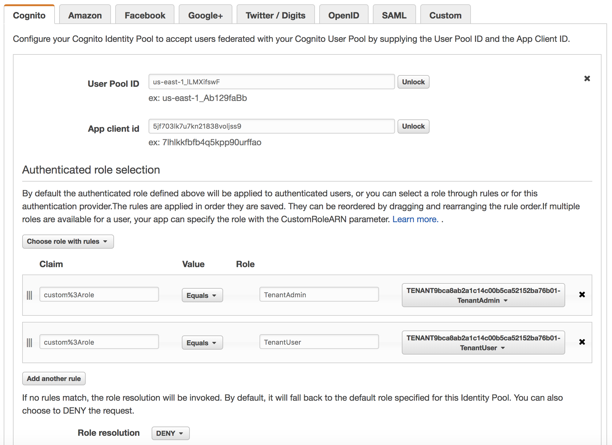</p>

**Recapitulando**: Agora você completou a segunda fase do nosso isolamento de tenant. Com esse exercício, observamos as regras de mapeamento de roles no identity pool do Cognito. Esses mapeamentos associam diretamente as roles de tenant (TenantAdmin e TenantUser) às políticas que configuramos na primeira parte deste laboratório.

## Parte 4 - Obtendo credenciais baseado no escopo do tenant

Nesse ponto, todos os elementos do nosso esquema de isolamento estão prontos. Nós temos autenticação com o Cognito, roles provisionadas para cada tenant com escopo para acessar as tabelas do DynamoDB, e nós temos condições de mapeamento de roles configuradas no Cognito que irá conectar todos os usuários autenticados com a políticas correspondentes. Tudo o que resta agora é inserir o código em nossos serviços da aplicação que rodarão esses elementos e obterão credenciais que estabelecerão o escopo adequado de acesso de cada tenant.

Os passos a seguir guiarão você no processo de configuração e implantação da nova versão do serviço de gerenciamento de produtos que obtém essas credenciais baseadas no escopo do tenant.

**Passo 1** - Vamos começar olhando como o serviço de gerenciamento de produtos é modificado para suportar o isolamento de tenant. No Cloud9, navegue ao diretório `Lab3/Part4/product-manager/` e abra o arquivo `server.js` no editor dando um duplo clique ou clicando com o botão direito e selecionando **Open**.

<p align="center">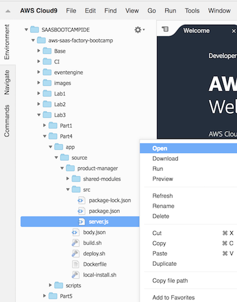</p>

O código abaixo destaca a última parte do quebra-cabeça do isolamento de tenant. Você irá notar que adicionamos uma chamada para nosso `tokenManager` que obtém as credenciais a partir do token de segurança do usuário autenticado. O método `getCredentialsFromToken()` recebe a requisição HTTP request e retorna as credenciais (`credentials`) que são com o **escopo do tenant**. Essas credenciais são utilizadas nas nossas chamadas para o `dynamoHelper` para assegurar que nós **não podemos cruzar os limites do tenant**.

```javascript
app.get('/product/:id', function (req, res) {
    winston.debug('Fetching product: ' + req.params.id);
    tokenManager.getCredentialsFromToken(req, function (credentials) {
        // init params structure with request params
        var params = {
            tenant_id: tenantId,
            product_id: req.params.id
        };
        // construct the helper object
        var dynamoHelper = new DynamoDBHelper(productSchema, credentials, configuration);
        dynamoHelper.getItem(params, credentials, function (err, product) {
            if (err) {
                winston.error('Error getting product: ' + err.message);
                res.status(400).send('{"Error" : "Error getting product"}');
            } else {
                winston.debug('Product ' + req.params.id + ' retrieved');
                res.status(200).send(product);
            }
        });
    });
});
```
**Passo 2** - Para chamar o `getCredentialsFromToken()` descrito acima é onde toda mágica acontece em termos de mapear nosso token/identidade para as políticas apropriadas, e retornar isso em forma de credencial. Dado a importância dessa função, vamos olhar mais de perto o que está acontecendo. Abaixo está um pedaço de código do `TokenManager` que implementa a função `getCredentialsFromToken()`:

```javascript
module.exports.getCredentialsFromToken = function (req, updateCredentials) {
    var bearerToken = req.get('Authorization');
    if (bearerToken) {
        var tokenValue = bearerToken.substring(bearerToken.indexOf(' ') + 1);
        if (!(tokenValue in tokenCache)) {
            var decodedIdToken = jwtDecode(tokenValue);
            var userName = decodedIdToken['cognito:username'];
            async.waterfall([
                function (callback) {
                    getUserPoolWithParams(userName, callback);
                },
                function (userPool, callback) {
                    authenticateUserInPool(userPool, tokenValue, callback);
                }
            ], function (error, results) {
                if (error) {
                    winston.error('Error fetching credentials for user');
                    updateCredentials(null);
                } else {
                    tokenCache[tokenValue] = results;
                    updateCredentials(results);
                }
            });
        } else if (tokenValue in tokenCache) {
            winston.debug('Getting credentials from cache');
            updateCredentials(tokenCache[tokenValue]);
        }
    }
};
```

Vamos destacar algums elementos chaves desta função.
* A priemira ação é extrair o `bearerToken` da requisição HTTP. Este é o token que você recebeu do Cognito depois de ter autenticado com seu usuário.
* Nós então decodificamos esse token e extraimos o atributo `userName`.
* Depois, uma série de chamadas são executadas em sequência. Começa pela busca do `userPool` do usuário, depois é chamada o `authenticateUserInPool()`. Essa função, que faz parte da classe auxiliar `TokenManager`, enfim, chama o método do Cognito `getCredentialsForIdentity()` passando o token do usuário.

É essa chamada para o Cognito que **ativa o mapeamento de roles** que configuramos previamente. O Cognito irá extrair a role do token fornecido and relacionar com a política correspondente, então construir um **conjunto temporário de credenciais com escopo** que são retornadas para a função que chamou.

**Passo 3** - Então é isso que o código faz por trás das câmeras. Agora, vamos implantar a nova versão do serviços de gerenciamento de produto para vê-lo em ação. No Cloud9, navegue até o diretório `Lab3/Part4/product-manager`, clique com o botão direto no arquivo `deploy.sh`, e depois clique em **Run** para executar o script shell.

<p align="center">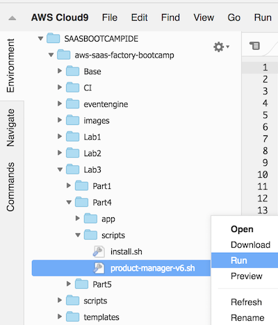</p>

**Passo 4** - Aguarde até o script `deploy.sh` executar com sucesso.

<p align="center">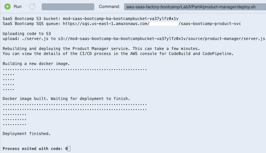</p>

**Passo 5** - Vamos verificar se todas as partes desse processo estão funcionando. Use a mesma URL da aplicação web que utilizamos até agora. Se o **TenantTwo** ainda está logado, deslogue usando o dropdown no topo esquerdo da barra de navegação da aplicação. Agora, logue como o **TenantOne** e acesse seus dados selecionando **Catalog** no menu e vendo os produtos do **TenantOne** aparecendo na tela. **Tudo deveria funcionar**.

Embora seja ótimo ver esse trabalho, é difícil saber se esse novo código está realmente aplicando nosso isolamento de tenant. Esse é sempre um caso difícil de testar. Vamos tentar um pouco do método de força bruta na Parte 5.

**Recapitulando**: Nós olhamos o código fonte para ver como combinamos junto o JWT **token de segurança bearer** dos cabeçalhos HTTP, nossos **claims customizados**, o **mapeamento de role para política** do Cognito, e o retorno das **credenciais temporárias do STS** para aplicar no isolamento de tenant no nosso sistemas. Nós então implantamos uma versão atualizada do serviço de gerenciamento do produto para remover nosso "hack de segurança" manual dos passos anteriores.

## Parte 5 - Verificando credenciais com escopo do tenant

Nesse momento, nós incorporamos segurança a nível de IAM utilizando a função do Cognito
`getCredentialsForIdentity()`, mas não avaliamos se podemos contornar/burlar nossas medidas de segurança. Como fizemos antes, vamos **manualmente sobreescrever o identificador do tenant** para verificar se conseguimos quebrar o isolamento de tenants. Isso irá demonstrar se, contanto que as políticas de acesso e roles definidas anteriormente sejam configuradas corretamente, **nossas medidas de isolamento de tenant não podem ser derrotadas** introduzindo um tenant diferente da identidade SaaS autenticada.

**Passo 1** - Como antes, modificaremos o código-fonte de nosso serviço de gerenciamento de produto mais recente e injetaremos manualmente um identificador de tenant. No Cloud9 navegue até a pasta `Lab3/Part5/product-manager/` e abra o arquivo `server.js` no editor dando um duplo clique ou clicando com o botão direito do mouse e selecionando **Open**.

<p align="center">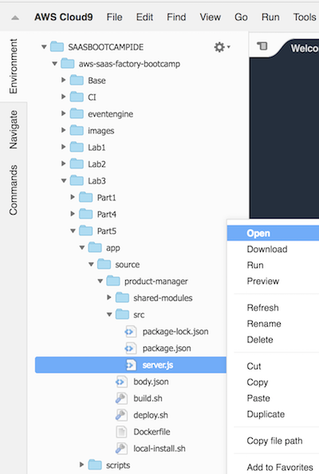</p>

**Passo 2** - Localize a função `GET` que busca todos os produtos por tenant. O código parecerá como:

```javascript
app.get('/products', function(req, res) {
	winston.debug('Fetching Products for Tenant Id: ' + tenantId);
	tokenManager.getCredentialsFromToken(req, function (credentials) {
		var searchParams = {
			TableName: productSchema.TableName,
			KeyConditionExpression: "tenant_id = :tenant_id",
			ExpressionAttributeValues: {
				":tenant_id": tenantId
				//":tenant_id": "<INSERT TENANTTWO GUID HERE>"
			}
		};
		// construct the helper object
		var dynamoHelper = new DynamoDBHelper(productSchema, credentials, configuration);
		dynamoHelper.query(searchParams, credentials, function(error, products) {
			if (error) {
				winston.error('Error retrieving products: ' + error.message);
				res.status(400).send('{"Error": "Error retrieving products"}');
			} else {
				winston.debug('Products successfully retrieved');
				res.status(200).send(products);
			}
		});
	});
});
```

Iremos mais uma vez **injetar manualmente** o `tenant_id` para o **TenantTwo** para verificar se nosso novo código evitará acesso cruzado de tenant. Localize o `tenant_id` que você salvou previamente do DynamoDB para o **TenantTwo** e _**substitua**_ o `tenant_id` com esse valor. Então, quando finalizar, o código parecerá como:

```javascript
app.get('/products', function (req, res) {
    winston.debug('Fetching Products for Tenant Id: ' + tenantId);
    tokenManager.getCredentialsFromToken(req, function (credentials) {
        var searchParams = {
            TableName: productSchema.TableName,
            KeyConditionExpression: "tenant_id = :tenant_id",
            ExpressionAttributeValues: {
                ":tenant_id": "TENANT4c33c2eae9974615951e3dc04c7b9057"
            }
        };
        // construct the helper object
        var dynamoHelper = new DynamoDBHelper(productSchema, credentials, configuration);
        dynamoHelper.query(searchParams, credentials, function (error, products) {
            if (error) {
                winston.error('Error retrieving products: ' + error.message);
                res.status(400).send('{"Error" : "Error retrieving products"}');
            } else {
                winston.debug('Products successfully retrieved');
                res.status(200).send(products);
            }
        });
    });
});
```

**Passo 3** - Agora nós precisamos implantar nosso microsserviço de gerenciamento de produtos atualizado com nossa violação de acesso cruzada entre tenats. Primero, salve o arquivo`server.js` editado no Cloud9 clicando em **File** na barra de tarefas, e depois clique em **Save**.

<p align="center">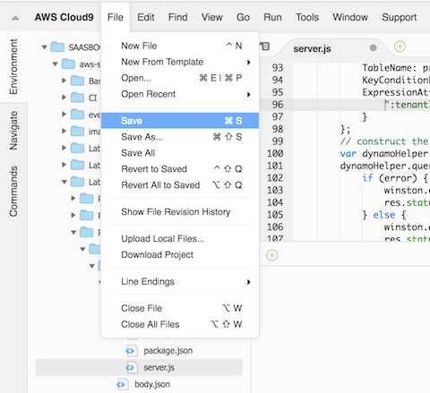</p>

**Passo 4** - Para implantar nosso serviço modificado, navegue até o diretório `Lab3/Part5/product-manager/` e clique com o botão direito do mouse no arquivo `deploy.sh`, e depois clique em **Run** para executar um script shell.

<p align="center">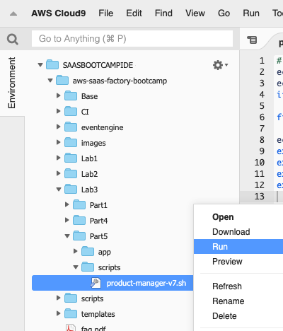</p>

**Passo 5** - Aguarde até que o script do `deploy.sh` execute com sucesso.

<p align="center">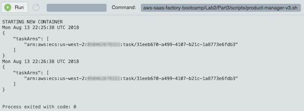</p>

**Passo 6** - Com nossa nova versão do serviço implantada, podemos observar como isso impactou a aplicação. Vamos logar de volta no sistema com as credenciais do **TenantOne** que criamos acima (se **TenantTwo** ainda estiver logado, faça deslogue usando o dropdown no topo direito da página).

**Passo 7** - Selecione **Catalog** na opção do menu no topo da página. Isso deve exibir o catálogo de seu usuário **TenantOne** que você acabou de autenticar Você verá que **nenhum produto é mostrado**. De fato, se você olhar o console de logs do Javascript (use as ferramentas de desenvolvedor do seu navegador), você verá que foi gerado um erro. Isso acontece porque estamos logados como **TenantOne** e nosso serviço tem fixado no código o **TenantTwo**. Isso deixa claro que nossas políticas de isolamento estão sendo aplicadas já que as **credenciais que adquirimos nos proibiram de acessar os dados do TenantTwo**.

**Recapitulando**: Com este último passo, nós conectamos todos os conceitos de **isolamento de tenants** no código do serviço de gerenciamento de produto. Nós adicionamos chamadas específicas que fazem a troca do nosso token autenticado por **credenciais com escopo do tenant** que nós utilizamos para acesso o DynamoDB. Com esse **novo nível de aplicação do isolamento**, tentamos fixar algo no código que tentou ultrapassar os limites do tenant o que confirmou que nossas políticas **proibiram o acesso cruzado de tenants**.
