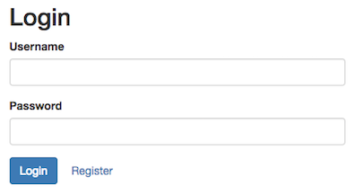
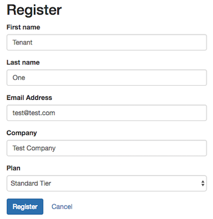
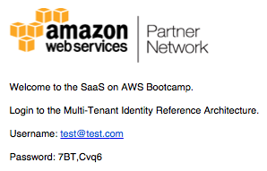
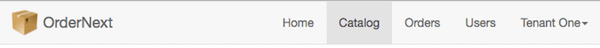
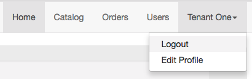
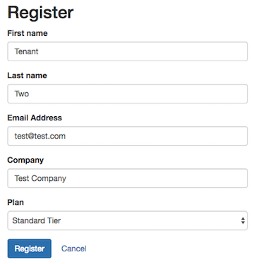

# Lab 3 – Isolating Tenant Data

### Overview

At this stage, we have addressed many of the core elements of SaaS architecture. What we really haven't touched on, though, is tenant isolation. As a SaaS provider, you must make every attempt to ensure that that each tenant's resources are protected from any kind of cross-tenant access. This is especially challenging when these tenants are sharing elements of their infrastructure. If, for some reason, one tenant was able to access another tenant's environment, that could represent a huge setback for a SaaS business.

To address this, we must move beyond basic authentication. We must introduce policies and access controls that ensure that we are doing everything we can to isolate and protect tenant environments. Even in SaaS environments where resources are not shared, we must take extra measures to be sure that we've minimized our exposure to cross-tenant access.

For this bootcamp, we'll focus squarely on how to isolate the data that resides in our DynamoDB tables. Specifically, we want to look at how can we can successfully isolate the tenant data that resides in the product and order tables that hold application data. To achieve this, we need to consider how we've partitioned the data. Below is a diagram that highlights the partitioning scheme of the product and order tables.

<p align="center"></p>

In these tables, you'll see that we have data from multiple tenants living side-by-side as items in these tables. So, if I get access to one of these tables, I could presumably get access to any tenant's data.

Our goal, then, is to implement a security model that can scope access to these tables down to the item level. Essentially, I want to build a view of the table that constrains access to just those items that are valid for a given tenant.

For this bootcamp, we're going to leverage a combination of Amazon Cognito, Amazon Identity and Access Management (IAM), and AWS Security Token Service
(STS) to limit access to these tables. This will connect directly to the notion of SaaS identity we discussed earlier, leveraging the tokens from the experience to bind a user to a scoped set of policies.

There are two key phases to implementing this isolation model. First, when tenants are initially provisioned, we need to create a set of IAM roles for each tenant. For every role that exists in the tenant's environment, we must create policies that scope access to the system's resource for that tenant. Below you'll see a conceptual representation of this the onboarding process and how it creates these roles for each tenant.

<p align="center"></p>

On the left is the registration process we built in Lab 1. On the right are collections of policies that are emitted (behind the scenes) for each role. It's important to note that you are not required to have separate roles for each user. Instead, these roles apply to all users for that tenant.

The second phase of isolation comes into play when you are accessing resources from your code. The diagram below illustrates the fundamental moving parts of this process.

<p align="center"></p>

In this example, you'll see that our product manager service is invoked from the UI with a request to get a list of products. You'll note that the token (acquired during authentication) is passed along here in the Authorization header of our HTTP request. This token includes data about the user identity, role, and tenant identity. While this token is valuable for conveying user and tenant attributes, it does nothing to control a tenant's access to resources. **Instead, we must use the data in this token to acquire the scoped credentials we need to access our DynamoDB tables**.

The remaining bits of the diagram illustrate how these scoped credentials are acquired. Once our `GET` request comes into our product manager service, we'll make a `getCredentialsForIdentity()` call to Cognito, passing in our token. Cognito will then crack that token open, examine the tenant identifier and user role and match it to one of the policies that were created during provisioning. It will then create a **temporary** set of credentials (shown at the bottom) via STS and return those to our product manager service. Our service will use these temporary credentials to access DynamoDB tables with confidence that these credentials will scope access _by tenant id_.

### What You'll Be Building
Our goal in this exercise is to walk you through the configuration and creation of some of the elements that are part of this process. While the concepts are helpful above, we want to expose you to some of the specifics of how they are used in our reference solution. We'll start by introducing the policies during provisioning and how to configure Cognito to connect our policies to user roles. Lastly, we'll look at how this lands in the code of our application services. The basic steps in this process include:

* **Example of Cross Tenant Access** – first you'll look at how, without policies and scoping, a developer can create a situation that violates the cross-tenant boundaries of the system.
* **Configure the Provisioned IAM Policies** – now that you've seen an example of cross tenant access, let's start to introduce policies that can be used to prevent cross-tenant access (intended or un-intended). You'll create a policy for different role/resource combinations to get a sense of how these policies are used to scope access to DynamoDB tables. You'll then provision a new tenant and see how these policies are represented in IAM.
* **Mapping User Roles to Policies** – with Cognito, we can create rules that determine how a user's role will map to the policies that we've created. In this part you'll see how these policies have been configured for our tenant and user roles.
* **Acquiring Tenant-Scoped Credentials** – finally you'll see how to orchestrate the acquisition of credentials that are scoped by the policies outlined above. The credentials will control our access to data. You'll see how this explicitly enforces cross-tenant scoping.

With this piece in place, you'll now have added a robust mechanism to your solution that much more tightly controls and scopes access to tenant resources. This solution highlights one of many strategies that could be applied to enforce tenant isolation.

## Part 1 - Example of Cross-Tenant Access
Before we introduce **policies**, it would help to examine a scenario where the absence of richer security policies can open the door to cross-tenant access. We will look at an (admittedly contrived) example where a developer could introduce code that might enable cross-tenant access.

To do this, we'll return to the product manager service and look at how manually injected tenant context could surface data in your application that should not be surfaced. This will set the stage for understanding how the introduction of **policies** can prevent this from happening.

**Step 1** - To begin, let's return to the application and **onboard a new tenant**. Navigate to the application URL and you'll be placed at the login landing page. If you have a tenant that is still logged in, use the dropdown at the top right of the page log the tenant out of the system. Now, once on the login page, select the **Register** button.

<p align="center"></p>

**Step 2** - Upon selecting the **Register** button, you'll be provided with a form where you can register your new tenant. Enter the data for your new tenant. For this tenant, the first name should be **Tenant** and the last name should be entered as **One** (the lab will refer to this tenant as **TenantOne** going forward). Also, be sure to use an email address that has not previously been used. Once you register the tenant you'll see a **Success** message indicating that you should check your email for further instructions.

<p align="center"></p>

**Step 3** - It's now time to check your email for the validation message that was sent by Cognito. You should find a message in your inbox that includes your username (your email address) along with a temporary password (generated by Cognito). The message will be similar to the following:

<p align="center"></p>

**Step 4** - We can now login to the application using these credentials. Return to the application using the URL provided above and you will be presented with a login form (as shown below). Enter the temporary credentials that were provided in your email and select the **Login** button.

<p align="center"></p>

**Step 5** - Cognito will detect that this is a temporary password and indicate that you need to setup a new password for your account. To do this, application redirects you to a new form where you'll setup your new password (as shown below). Create your new password and select the **Confirm** button.

<p align="center"></p>

**Step 6** - After you've successfully changed your password, you'll be logged into the application and landed at the home page. Now we can enter some data for your newly created tenant. Navigate to the **Catalog** option at the top of the page to access the product catalog.

<p align="center"></p>

**Step 7** - Now let's add some products to our catalog. Select the **Add Product** button from the top right of the page. Fill in the details with the product data of your choice. However, for the **SKU**, precede all of your SKU's with **TENANTONE**. So, SKU one might be "**TENANTONE-ABC**". The key here is that we want to have _specific_ values that are prepended to your SKU that clearly identify the products as belonging to this specific tenant.

<p align="center"></p>

**Step 8** - Now we need to **repeat** this same process for **another tenant**. First, we need to logout of the current tenant by selecting the dropdown from top right of the screen with your tenant name and select **Logout**.

<p align="center"></p>

**Step 9** - You'll now be placed back at the login page where you can select the **Register** button to register your new tenant. Enter the data for your new tenant. For this tenant, the **first name** should be **Tenant** and the **last name** should be entered as **Two** (the lab will refer to this tenant as **TenantTwo** going forward). Also, be sure to use an email address that has not been previously used. Once you register the tenant you'll see a **Success** message indicating that you should check your email for further instructions.


<p align="center"></p>

**Step 10** - It's now time to check your email for the validation message that was sent by Cognito. You should find a message in your inbox that includes your username (your email address) along with a temporary password (generated by Cognito). The message will be similar to the following:

<p align="center"></p>

**Step 11** - We can now login to the application using these credentials. Return to the application using the URL provided above and you will be presented with a login form (as shown below). Enter the temporary credentials that were provided in your email and select the **Login** button.

<p align="center"></p>

**Step 12** - Cognito will detect that this is a temporary password and indicate that you need to setup a new password for your account. To do this, application redirects you to a new form where you'll setup your new password (as shown below). Create your new password and select the **Confirm** button.

<p align="center"></p>

**Step 13** - After you've successfully changed your password, you'll be logged into the application and landed at the home page. As before, click on the **Catalog** menu and then click the **Add Product** button to fill in the details with the product data of your choice. However, for the SKU, precede all of your SKU's with **TENANTTWO**. So, SKU one might be **TENANTTWO-ABC**. The key here is that we want to have _specific_ values that are prepended to your SKU that clearly identify the products as belonging to this specific tenant.

<p align="center"></p>

**Step 14** - Now we have a **2** tenants with products that belong exclusively to each tenant. Let's go find the tenant identifiers for these newly created tenants. Navigate to the **DynamoDB** service in the **AWS console** and select the **Tables** option located on the upper left-hand side of the page.

<p align="center"></p>

**Step 15** - Locate the two tenants you created within the list by identifying the tenant with the username/email that you used above. **Capture the tenant identifiers for both of these tenants**. You'll need these values in subsequent steps.
 
**Step 16** - Now let's go back to the code of our product manager service and make a modification. Open our product manager server.js file in our Cloud9 IDE. In Cloud9, navigate to `Lab3/Part1/app/source/product-manager/`. Open the file in the editor by either double-clicking or right-click `server.js` and click **Open**.

<p align="center"></p>

**Step 17** - Locate the `GET` function that fetches all products for a tenant. The code function will appear as follows:

```javascript
app.get('/products', function (req, res) {
    winston.debug('Fetching Products for Tenant Id: ' + tenantId);
    var searchParams = {
        TableName: productSchema.TableName,
        KeyConditionExpression: "tenantId = :tenantId",
        ExpressionAttributeValues: {
            ":tenantId": tenantId
            //":tenantId": "<INSERT TENANTTWO GUID HERE>"
        }
    };
    // construct the helper object
    tokenManager.getSystemCredentials(function (credentials) {
        var dynamoHelper = new DynamoDBHelper(productSchema, credentials, configuration);
        dynamoHelper.query(searchParams, credentials, function (error, products) {
            if (error) {
                winston.error('Error retrieving products: ' + error.message);
                res.status(400).send('{"Error" : "Error retrieving products"}');
            } else {
                winston.debug('Products successfully retrieved');
                res.status(200).send(products);
            }

        });
    });
});
```

This function is invoked by the application to acquire a list of products that populate the catalog page of system. You can see that it references the `tenantId` that was extracted from the security token passed into our application. Let's consider what might happen if were **manually replace** this `tenantId` with another value. Locate the `tenantId` that you recorded earlier from DynamoDB for **TenantTwo** and _**replace**_ the `tenantId` with this value. So, when you're done, it should appear similar to the following:

```javascript
app.get('/products', function (req, res) {
    winston.debug('Fetching Products for Tenant Id: ' + tenantId);
    var searchParams = {
        TableName: productSchema.TableName,
        KeyConditionExpression: "tenantId = :tenantId",
        ExpressionAttributeValues: {
            ":tenantId": "TENANT4c33c2eae9974615951e3dc04c7b9057"
        }
    };
    // construct the helper object
    tokenManager.getSystemCredentials(function (credentials) {
        var dynamoHelper = new DynamoDBHelper(productSchema, credentials, configuration);
        dynamoHelper.query(searchParams, credentials, function (error, products) {
            if (error) {
                winston.error('Error retrieving products: ' + error.message);
                res.status(400).send('{"Error" : "Error retrieving products"}');
            } else {
                winston.debug('Products successfully retrieved');
                res.status(200).send(products);
            }

        });
    });
});
```

**Step 18** - Now we need to deploy our updated product manager microservice with our cross tenant access violation in-place. First, save your edited `server.js` file in Cloud9 by clicking **File** on the toolbar followed by **Save**.

<p align="center"></p>

**Step 19** - To deploy our modified service, navigate to the `Lab3/Part1/scripts` directory and right-click `product-manager-v5.sh`, and click **Run** to execute the shell script.

<p align="center"></p>

**Step 20** - Wait for the `product-manager-v5.sh` shell script to execute successfully, as confirmed by the **STARTING NEW CONTAINER** message followed by **Process exited with code: 0**.

<p align="center"></p>

**Step 21** - With our new version of the service deployed, we can now see how this impacted the application. Let's log back into the system with the credentials for **TenantOne** that you created above (if **TenantTwo** is still logged in, log out using the dropdown at the top right of the page).

**Step 22** - Select the **Catalog** menu option at the top of the page. This should display the catalog for your **TenantOne** user you just authenticated as. However, the _**list actually contains products that are from TenantTwo**_. We've now officially crossed the tenant boundary.

**Recap**: The key takeaway here is that authentication alone is not enough to protect your SaaS system. Without additional policies and authorization in place, the code of your system could un-intentionally access data for another tenant. Here we forced this condition more explicitly, but you can imagine how more subtle changes by a developer could have an un-intended side effect.
