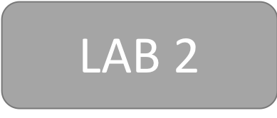
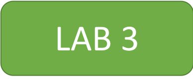

# Building SaaS Solutions on AWS

This Bootcamp is also available in [Portuguese (pt-br) language](README-pt-br.md).

# Introduction
SaaS presents developers with a unique blend of challenges: multi-tenancy, onboarding, security, data partitioning, tenant isolation, and identity.

One of the best ways to understand architectural principles of SaaS is to dig into working examples of designing, building, and optimizing SaaS. In this bootcamp workshop, we’ll expose you to the core concepts of SaaS architecture by diving into a reference SaaS architecture where you can see the moving parts of a SaaS solution in action.

This workshop provides a series of activities for attendees to interact with a functional solution, and hands-on exercises that introduce code and configuration to realize and extend the capabilities of this SaaS environment. The combination of lecture and exercises through the lens of a working reference solution give greater insight into SaaS on AWS best practices.

# Who should participate?
Application developers and architects that are looking to get into the details of implementing a SaaS solution on AWS are encouraged to participate. The content of the bootcamp is geared toward those newer to SaaS. However, even if you have a background in SaaS, this experience could still expose you to specifics of delivering SaaS on AWS.

# How do I start?
If you are participating in this bootcamp workshop during an AWS event, follow the instructions of the instructors on site.

If you would like to run through the lab exercises in a self-guided manner, all you need to do is launch the [workshop.yml](https://github.com/aws-samples/aws-saas-factory-bootcamp/blob/master/resources/workshop.yml) AWS CloudFormation template in your AWS account and then start by clicking the Lab 1 icon below.

Note that this workshop deploys infrastructure into your AWS account that is outside of the free tier, and you should delete the CloudFormation stack when you are finished to minimize costs. The Cognito resources and IAM roles and policies created by the onboarding system will need to be removed manually after the stack delete. 

# Lab Guides
### Lab 1 - Identity and Onboarding

### Lab 2 - Multi-Tenant Microservices

### Lab 3 - Data Isolation

# License
This workshop is licensed under the Apache 2.0 License. See the [LICENSE](LICENSE) file.